# 画面遷移設計

---

# 0️⃣ 設計前提

| 項目 | 内容 |
| --- | --- |
| 対象ユーザー | 未ログインユーザー / `PlatformAdmin` / `TenantAdmin` / `HackathonOrganizer` / `Sponsor` / `Judge` / `Hacker` |
| デバイス | Responsive 前提。管理者系と送信者系は Desktop 優先、`Hacker` はメール閲覧を考慮して Mobile も重視 |
| 認証要否 | 招待 URL、登録、ログイン関連のみ未ログイン利用可。アプリ本体は全面認証制 |
| 権限制御 | RBAC + ABAC。Global / Tenant / Hackathon スコープ、送信可能ロール、スカウト受信可否、機能 ON / OFF を考慮 |
| MVP範囲 | Tenant 作成、Hackathon 作成、招待 URL + 参加パスワード、メール認証、ロール / スコープ切替、Sponsor 閲覧範囲設定、Hackathon 単位設定、スカウト送信、メール通知 |
| 招待前提 | `Hacker` / `Judge` は Hackathon 参加用 URL、`Sponsor` は Tenant 参加用 URL を利用する |
| ロール原則 | 管理ロールは `PlatformAdmin` / `TenantAdmin` / `HackathonOrganizer`、送信ロールは `Sponsor` / `Judge` として扱う。送信画面は送信ロール保有時のみ利用可能 |
| 複数ロール前提 | 同一ユーザーが `TenantAdmin` と `HackathonOrganizer` の両方を持つことを許容し、UI ではコンテキスト切替を提供する |

---

# 1️⃣ 画面一覧

## P0 画面

| ID | 画面名 | 役割 | 主な利用者 | 認証 | 優先度 |
| --- | --- | --- | --- | --- | --- |
| S-01 | サービス案内 / 入口 | ログイン、招待参加、登録導線の入口 | 未ログイン | 不要 | P0 |
| S-02 | Hackathon 招待ページ | `Hacker` / `Judge` 用の招待内容を表示する | 未ログイン | 不要 | P0 |
| S-03 | Sponsor 招待ページ | `Sponsor` 用の招待内容を表示する | 未ログイン | 不要 | P0 |
| S-04 | 参加パスワード入力 | 招待 URL に対応する参加パスワードを入力する | 未ログイン | 不要 | P0 |
| S-05 | 新規登録 | メールアドレス、基本情報の登録 | 未ログイン | 不要 | P0 |
| S-06 | メール認証案内 | 認証メール送信済みの案内 | 未ログイン | 不要 | P0 |
| S-07 | ログイン | 認証済みユーザーのログイン | 未ログイン | 不要 | P0 |
| S-08 | 認証コールバック / 初期振り分け | 認証後に利用可能ロールとスコープを解決する | 全ロール | 必須 | P0 |
| S-09 | ロール / スコープ選択 | 複数ロール・複数スコープを持つユーザーが利用中コンテキストを選ぶ | 複数ロール所持ユーザー | 必須 | P0 |
| S-10 | 招待無効 / 権限不足 | 無効 URL、誤ロール、期限切れ、アクセス不可時の案内 | 全ロール | 任意 | P0 |
| S-20 | 送信者ダッシュボード | `Sponsor` と送信権限付き `Judge` のホーム。閲覧可能 Hackathon を一覧表示 | `Sponsor` / `Judge` | 必須 | P0 |
| S-21 | スカウト作成 | 対象 Hackathon と受信者を選び、件名・本文を入力してスカウトを作る | `Sponsor` / `Judge` | 必須 | P0 |
| S-22 | スカウト確認 | 送信前の最終確認 | `Sponsor` / `Judge` | 必須 | P0 |
| S-23 | スカウト送信完了 | 送信成功を表示し次アクションへ戻す | `Sponsor` / `Judge` | 必須 | P0 |
| S-30 | 出場者ホーム | `Hacker` の最小ホーム。参加中 Hackathon と受信設定への入口 | `Hacker` | 必須 | P0 |
| S-31 | スカウト受信設定 | opt-in / opt-out を切り替える | `Hacker` | 必須 | P0 |
| S-40 | Judge ホーム | `Judge` の最小ホーム。参加中 Hackathon と利用可能機能を表示 | `Judge` | 必須 | P0 |
| S-50 | PlatformAdmin Dashboard | `PlatformAdmin` 向けのグローバル管理画面入口 | `PlatformAdmin` | 必須 | P0 |
| S-51 | Tenant 一覧 | Tenant の一覧と状態確認 | `PlatformAdmin` | 必須 | P0 |
| S-52 | Tenant 追加 | 新規 Tenant を作成する | `PlatformAdmin` | 必須 | P0 |
| S-53 | Tenant 初期設定 | 初期 `TenantAdmin` 割り当てと Tenant 状態設定を行う | `PlatformAdmin` | 必須 | P0 |
| S-60 | TenantAdmin Dashboard | Tenant 単位管理の入口。Hackathon、Sponsor、範囲設定へ遷移 | `TenantAdmin` | 必須 | P0 |
| S-61 | Tenant 概要 / Hackathon 一覧 | 配下 Hackathon と Sponsor を確認する | `TenantAdmin` | 必須 | P0 |
| S-62 | Sponsor 招待管理 | `Sponsor` 用招待の発行、有効期限設定、再発行、無効化を行う | `TenantAdmin` | 必須 | P0 |
| S-63 | Sponsor 表示範囲設定 | `Sponsor` ごとに閲覧可能 Hackathon を設定する専用画面 | `TenantAdmin` | 必須 | P0 |
| S-64 | Hackathon 追加 | Tenant 配下に新規 Hackathon を作成する | `TenantAdmin` | 必須 | P0 |
| S-65 | HackathonOrganizer 割り当て | Hackathon ごとに `HackathonOrganizer` を割り当てる | `TenantAdmin` | 必須 | P0 |
| S-70 | HackathonOrganizer Dashboard | 担当 Hackathon の管理画面入口 | `HackathonOrganizer` | 必須 | P0 |
| S-71 | Hackathon 設定 | Hackathon の状態、スカウト ON / OFF、Judge 送信可否を設定する | `HackathonOrganizer` | 必須 | P0 |
| S-72 | Hackathon 招待管理 | `Hacker` / `Judge` 用招待の発行、有効期限設定、再発行、無効化を行う | `HackathonOrganizer` | 必須 | P0 |
| S-99 | 404 / 権限外 | 存在しない URL、ABAC 不許可時のフォールバック | 全ロール | 任意 | P0 |

## P1 以降の拡張画面

| ID | 画面名 | 役割 | 主な利用者 | 認証 | 優先度 |
| --- | --- | --- | --- | --- | --- |
| S-80 | スカウト一覧 | 送信済み / 受信済みのスカウト確認 | `Sponsor` / `Judge` / `Hacker` | 必須 | P1 |
| S-81 | スカウト詳細 | スカウト内容、状態、履歴の確認 | `Sponsor` / `Judge` / `Hacker` | 必須 | P1 |
| S-82 | Tenant 別メール文面設定 | Tenant ごとの通知文面を調整 | `TenantAdmin` | 必須 | P1 |
| S-90 | チーム検索 | 条件でスカウト候補を探す | `Sponsor` / `Judge` | 必須 | P1 |
| S-91 | AI ヒアリング | チーム情報を AI と対話して確認 | `Sponsor` | 必須 | P2 |

---

# 2️⃣ 全体遷移図（高レベル）

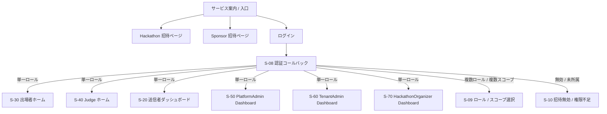

---

# 3️⃣ 招待参加フロー

## Hackathon 参加フロー

対象: `Hacker` / `Judge`

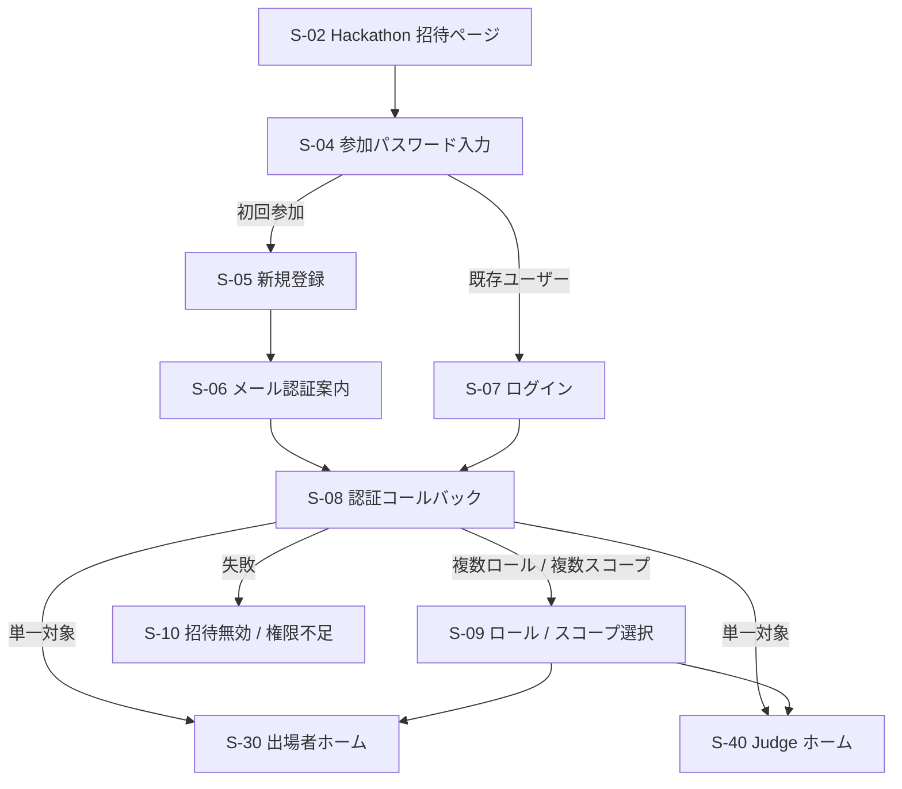

## Sponsor 参加フロー

対象: `Sponsor`

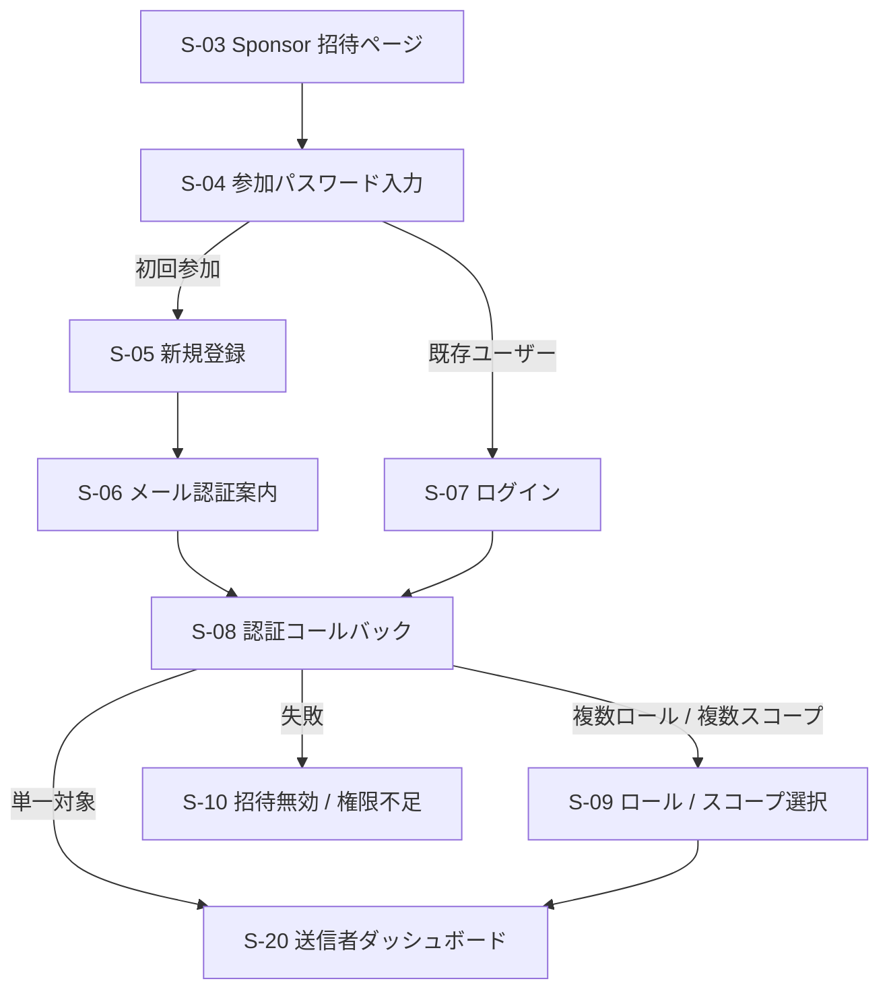

補足:

- 招待 URL と参加パスワードの両方を満たさない場合は `S-10` に遷移する。
- 招待 URL が期限切れ、または無効化済みの場合も `S-10` に遷移する。

---

# 4️⃣ ロール別ホーム遷移

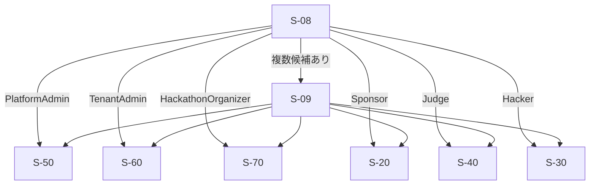

補足:

- 同一ユーザーが `TenantAdmin` と `HackathonOrganizer` を兼務する場合、`S-09` で利用中コンテキストを選ぶ。
- 同一ユーザーが `TenantAdmin` と `Sponsor` を兼務する場合も、`S-09` から管理系画面と送信者画面を切り替える。
- `Judge` が送信権限を持つ場合は、`S-40` から `S-20` へ遷移できる。

---

# 5️⃣ 送信者フロー（MVP）

対象: `Sponsor` / 送信権限を持つ `Judge`

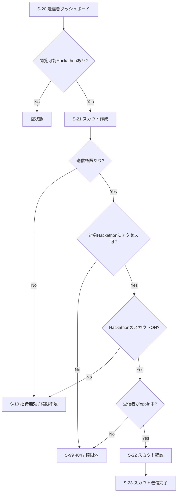

補足:

- `Sponsor` は `TenantAdmin` が表示許可した Hackathon だけを `S-20` に表示する。
- `Judge` は、参加中 Hackathon かつ送信権限が有効な場合のみ送信できる。
- `TenantAdmin` / `HackathonOrganizer` は、同一ユーザーが別途 `Sponsor` または `Judge` を持たない限り `S-20` に入らない。
- MVP では候補検索画面を分離せず、`S-21` 内で対象 Hackathon と送信先を選択する前提。

---

# 6️⃣ 出場者フロー（MVP）

対象: `Hacker`


補足:

- MVP の受信体験の中心はメールであり、アプリ内の受信一覧は P1 で追加する。
- `Hacker` が最低限必要とする P0 画面は、参加中 Hackathon の確認と受信設定画面。

---

# 7️⃣ Platform / Tenant / Hackathon 管理フロー

## 7.1 PlatformAdmin

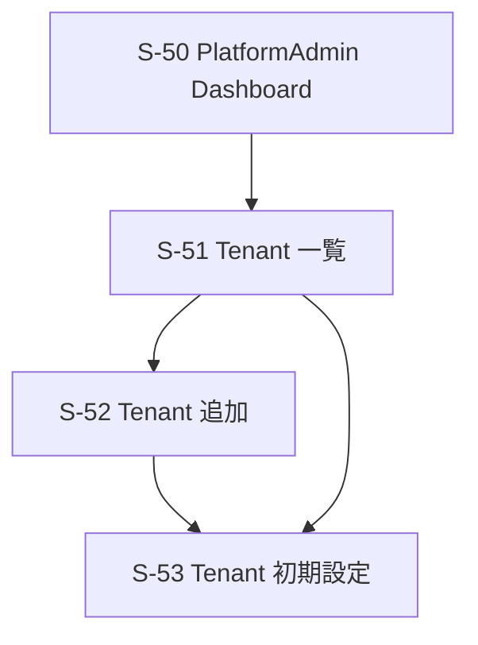

`S-53` で扱う P0 項目:

- Tenant 名
- Tenant 状態
- 初期 `TenantAdmin` 割り当て

## 7.2 TenantAdmin

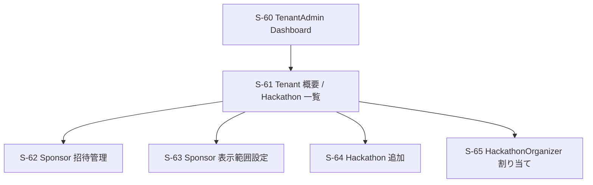

`S-62` で扱う P0 項目:

- Sponsor 招待 URL 発行
- 有効期限設定
- 有効期限候補は `5 / 7 / 14 / 30 / 60 / 90日`
- 参加パスワード設定
- 招待の再発行 / 無効化

`S-63` で扱う P0 項目:

- Sponsor ごとの閲覧可能 Hackathon 設定

`S-65` で扱う P0 項目:

- Hackathon ごとの `HackathonOrganizer` 割り当て

## 7.3 HackathonOrganizer

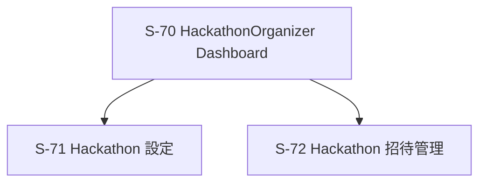

`S-71` で扱う P0 項目:

- Hackathon 名
- 公開 / 非公開状態
- スカウト機能 ON / OFF
- Judge 送信権限設定

`S-72` で扱う P0 項目:

- Hackathon 参加用招待 URL 発行
- 有効期限設定
- 有効期限候補は `5 / 7 / 14 / 30 / 60 / 90日`
- 参加パスワード設定
- 招待の再発行 / 無効化

---

# 8️⃣ 権限別分岐

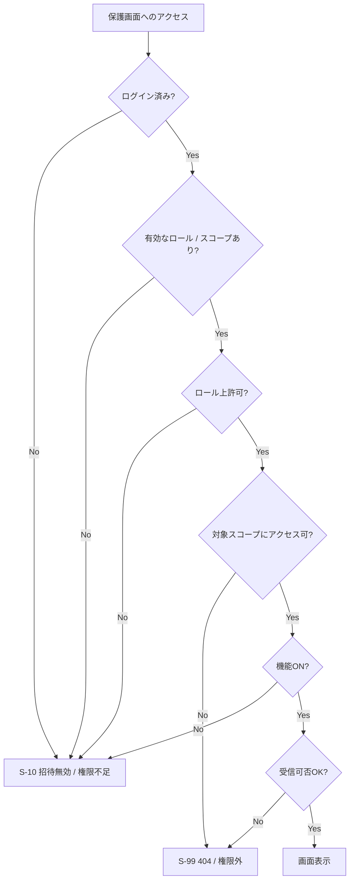

補足:

- `Sponsor` は Tenant 所属だけでは足りず、対象 Hackathon の閲覧許可が必要。
- `Judge` / `Hacker` は対象 Hackathon 所属である必要がある。
- opt-out 中の `Hacker` は 404 相当で扱う。

---

# 9️⃣ 状態別分岐

## 送信者ダッシュボード

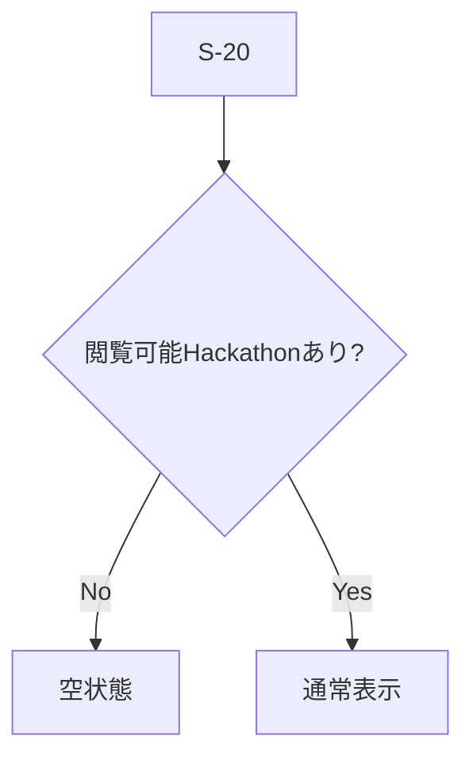

## TenantAdmin 画面


## ロール切替

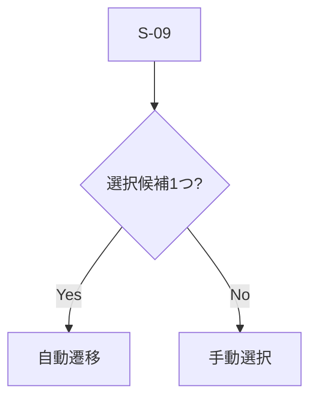

---

# 🔟 モーダル・非同期操作

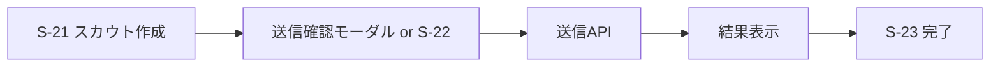

補足:

- 招待 URL 発行、有効期限変更、再発行、無効化、パスワード再設定も管理画面では確認モーダルを挟む前提でよい。
- バリデーションエラーは各フォーム画面に留める。

---

# 1️⃣1️⃣ エラーフロー

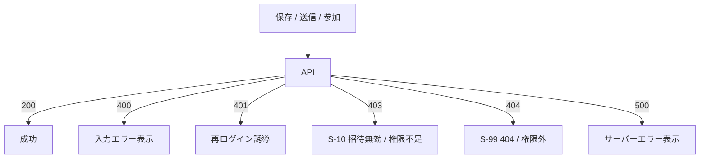

---

# 1️⃣2️⃣ モバイル考慮

| 項目 | Desktop | Mobile |
| --- | --- | --- |
| 管理系ナビゲーション | Sidebar または Header Nav | Drawer |
| 招待参加フロー | 補足情報を広めに表示 | 1 画面 1 アクションを優先 |
| ロール切替 | メニューまたはモーダル | セレクタまたはフルスクリーン |
| 出場者体験 | アプリ補助 | メール閲覧起点を重視 |

---

# 1️⃣3️⃣ URL 設計案

```text
/
/invite/hackathons/:token
/invite/sponsors/:token
/invite/password
/signup
/verify-email
/login
/auth/callback
/app/switch-context
/app/scouts
/app/scouts/new
/app/scouts/complete
/app/hacker
/app/hacker/preferences/scout
/app/judge
/platform
/platform/tenants
/platform/tenants/new
/platform/tenants/:tenantId
/tenant
/tenant/hackathons
/tenant/hackathons/new
/tenant/sponsors/invites
/tenant/sponsors/:sponsorId/scopes
/tenant/hackathons/:hackathonId/organizers
/organizer
/organizer/hackathons/:hackathonId
/organizer/hackathons/:hackathonId/invites
/access-denied
```

---

# 1️⃣4️⃣ レビュー観点

- `PlatformAdmin` を Tenant 作成と初期 `TenantAdmin` 割り当てに絞る方針で十分か
- `TenantAdmin` と `HackathonOrganizer` を兼務するユーザーの初期ホームを `S-09` 経由にしてよいか
- `TenantAdmin` が `HackathonOrganizer` 相当の上位権限を持つ前提でよいか
- `Judge` の P0 を「最小ホーム + 必要時だけ送信者画面へ遷移」でよいか
- `S-63` の Sponsor 範囲設定を専用画面のまま維持するか
