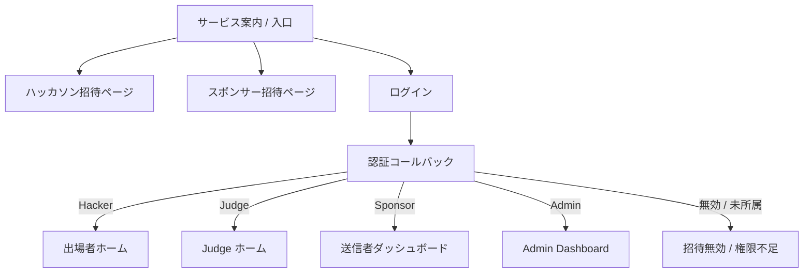
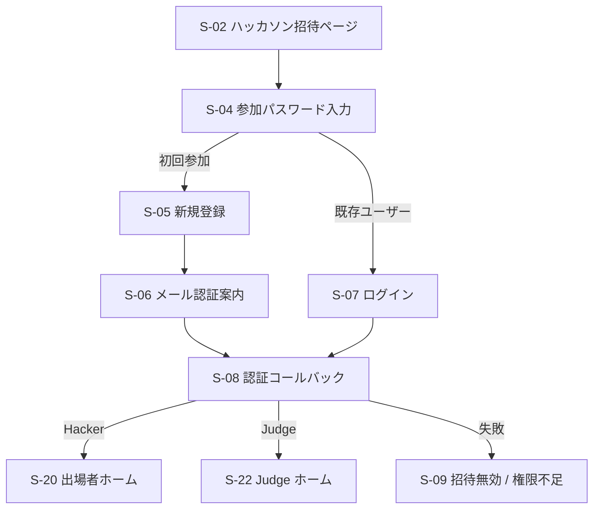
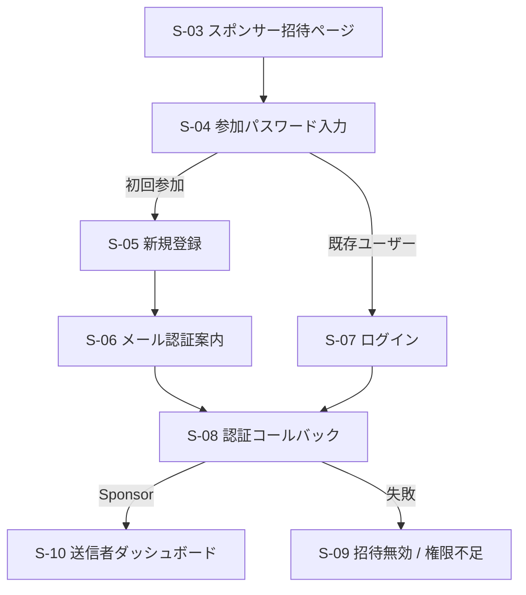
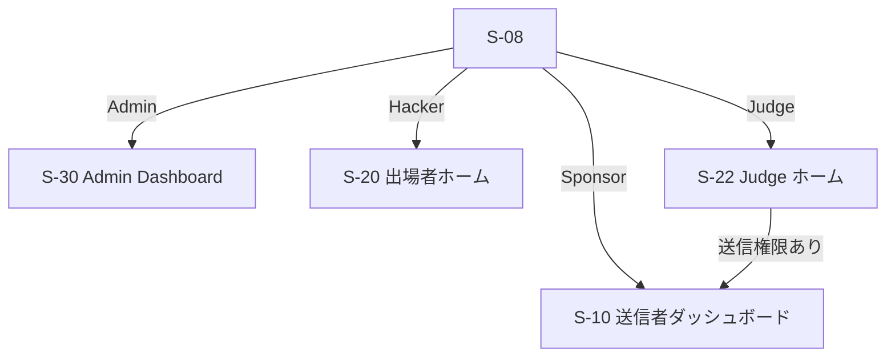
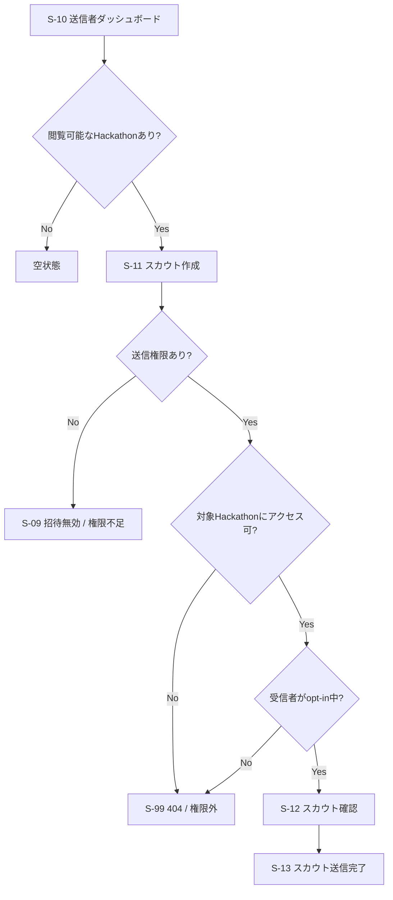
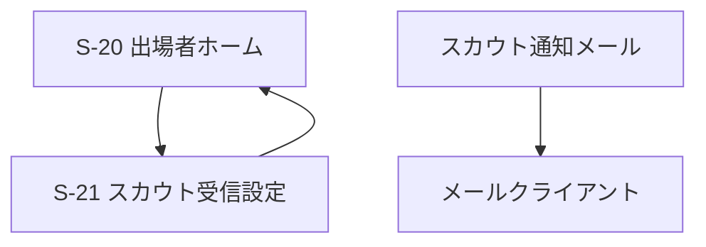
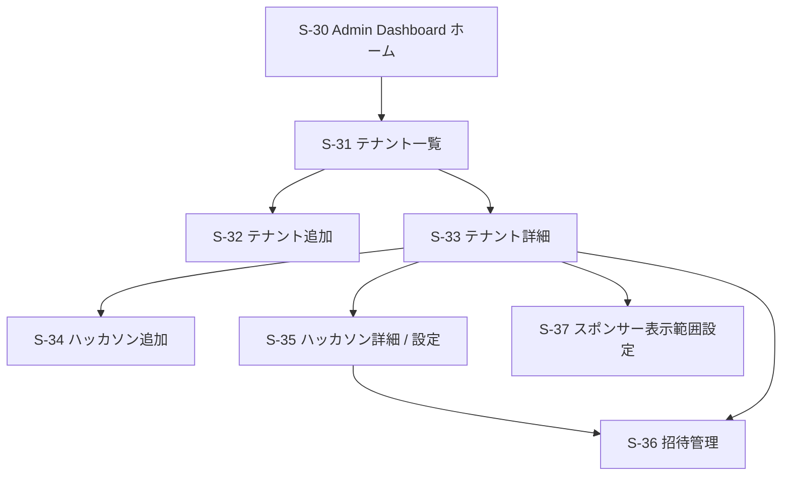
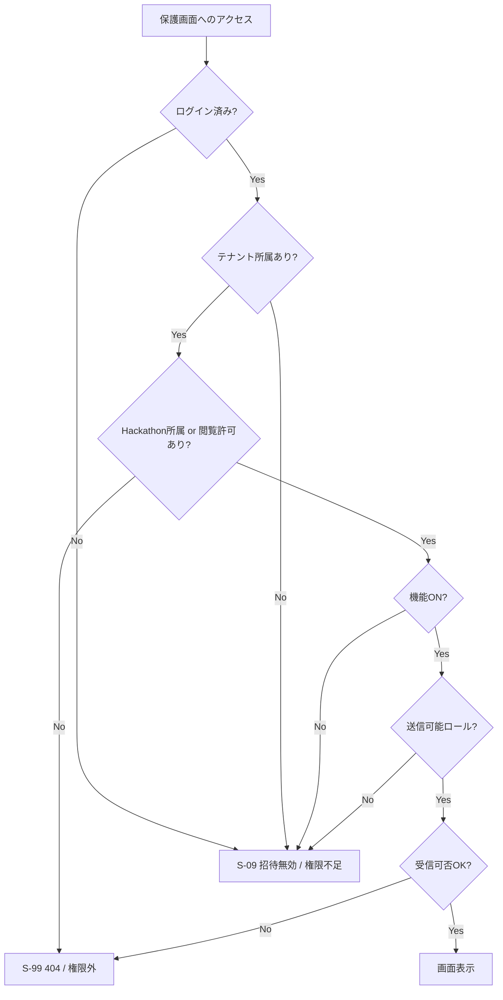
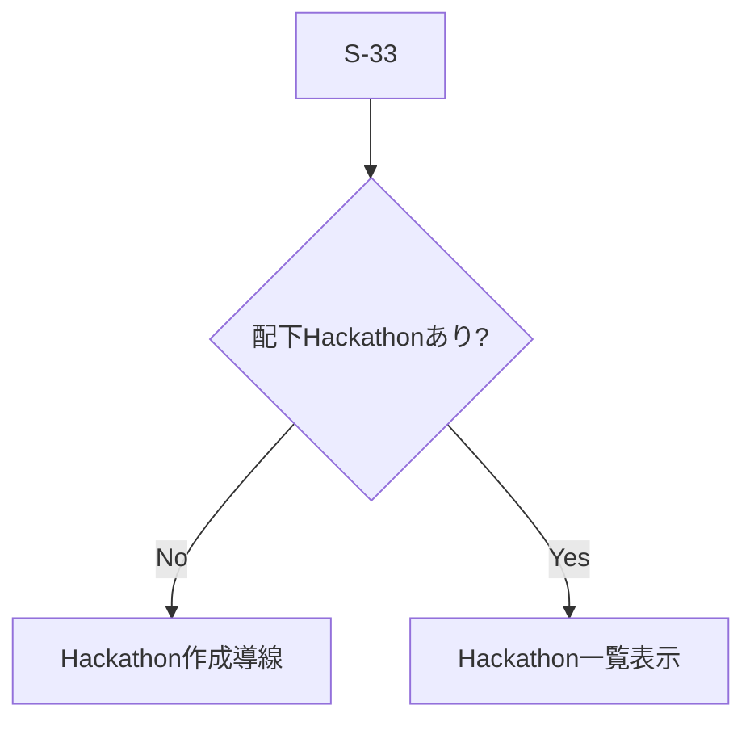
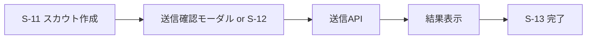

# 画面遷移設計

---

# 0️⃣ 設計前提

| 項目 | 内容 |
| --- | --- |
| 対象ユーザー | 未ログインユーザー / `Admin` / `Sponsor` / `Judge` / `Hacker` |
| デバイス | Responsive 前提。`Admin` / `Sponsor` / `Judge` は Desktop 優先、`Hacker` はメール閲覧を考慮して Mobile も重視 |
| 認証要否 | 招待 URL、登録、ログイン関連のみ未ログイン利用可。アプリ本体は全面認証制 |
| 権限制御 | RBAC + ABAC。テナント所属、ハッカソン所属、送信可能ロール、スカウト受信可否、機能 ON / OFF を考慮 |
| MVP範囲 | テナント作成、ハッカソン作成、招待 URL + 参加パスワード、メール認証、スポンサー閲覧範囲設定、スカウト送信、メール通知 |
| 招待前提 | `Hacker` / `Judge` はハッカソン参加用 URL、`Sponsor` はテナント参加用 URL を利用する |
| 仮置き前提 | `Judge` は最低限のホームを持ち、送信権限がある場合に送信者画面へ遷移する。高度な検索画面や AI 画面は P1 以降 |

---

# 1️⃣ 画面一覧

## P0 画面

| ID | 画面名 | 役割 | 主な利用者 | 認証 | 優先度 |
| --- | --- | --- | --- | --- | --- |
| S-01 | サービス案内 / 入口 | ログイン、招待参加、登録導線の入口 | 未ログイン | 不要 | P0 |
| S-02 | ハッカソン招待ページ | `Hacker` / `Judge` 用の招待内容を表示する | 未ログイン | 不要 | P0 |
| S-03 | スポンサー招待ページ | `Sponsor` 用の招待内容を表示する | 未ログイン | 不要 | P0 |
| S-04 | 参加パスワード入力 | 招待 URL に対応する参加パスワードを入力する | 未ログイン | 不要 | P0 |
| S-05 | 新規登録 | メールアドレス、基本情報の登録 | 未ログイン | 不要 | P0 |
| S-06 | メール認証案内 | 認証メール送信済みの案内 | 未ログイン | 不要 | P0 |
| S-07 | ログイン | 認証済みユーザーのログイン | 未ログイン | 不要 | P0 |
| S-08 | 認証コールバック / 初期振り分け | 認証後にテナント、ハッカソン、ロールに応じて遷移先を決める | 全ロール | 必須 | P0 |
| S-09 | 招待無効 / 権限不足 | 無効 URL、誤ロール、期限切れ、アクセス不可時の案内 | 全ロール | 任意 | P0 |
| S-10 | 送信者ダッシュボード | `Sponsor` と送信権限付き `Judge` のホーム。閲覧可能ハッカソンを一覧表示 | `Sponsor` / `Judge` | 必須 | P0 |
| S-11 | スカウト作成 | 対象ハッカソンと受信者を選び、件名・本文を入力してスカウトを作る | `Sponsor` / `Judge` | 必須 | P0 |
| S-12 | スカウト確認 | 送信前の最終確認 | `Sponsor` / `Judge` | 必須 | P0 |
| S-13 | スカウト送信完了 | 送信成功を表示し次アクションへ戻す | `Sponsor` / `Judge` | 必須 | P0 |
| S-20 | 出場者ホーム | `Hacker` の最小ホーム。参加中ハッカソンと受信設定への入口 | `Hacker` | 必須 | P0 |
| S-21 | スカウト受信設定 | opt-in / opt-out を切り替える | `Hacker` | 必須 | P0 |
| S-22 | Judge ホーム | `Judge` の最小ホーム。参加中ハッカソンと利用可能機能を表示 | `Judge` | 必須 | P0 |
| S-30 | Admin Dashboard ホーム | テナント管理者（契約者）向けの入口。Tenant / Hackathon / 招待管理へ遷移 | `Admin` | 必須 | P0 |
| S-31 | テナント一覧 | テナントの一覧と状態確認 | `Admin` | 必須 | P0 |
| S-32 | テナント追加 | 新規テナントを作成する | `Admin` | 必須 | P0 |
| S-33 | テナント詳細 | テナント設定、配下ハッカソン、スポンサーを確認する | `Admin` | 必須 | P0 |
| S-34 | ハッカソン追加 | テナント配下に新規ハッカソンを作成する | `Admin` | 必須 | P0 |
| S-35 | ハッカソン詳細 / 設定 | ハッカソンの状態、参加設定、送信権限を管理する | `Admin` | 必須 | P0 |
| S-36 | 招待管理 | 招待 URL の発行、有効期限設定、再発行、無効化、参加パスワード管理を行う | `Admin` | 必須 | P0 |
| S-37 | スポンサー表示範囲設定 | テナント管理者（契約者）が `Sponsor` ごとに閲覧可能ハッカソンを設定する専用画面 | `Admin` | 必須 | P0 |
| S-99 | 404 / 権限外 | 存在しない URL、ABAC 不許可時のフォールバック | 全ロール | 任意 | P0 |

## P1 以降の拡張画面

| ID | 画面名 | 役割 | 主な利用者 | 認証 | 優先度 |
| --- | --- | --- | --- | --- | --- |
| S-40 | スカウト一覧 | 送信済み / 受信済みのスカウト確認 | `Sponsor` / `Judge` / `Hacker` | 必須 | P1 |
| S-41 | スカウト詳細 | スカウト内容、状態、履歴の確認 | `Sponsor` / `Judge` / `Hacker` | 必須 | P1 |
| S-42 | メール文面設定 | テナント別の通知文面を調整 | `Admin` | 必須 | P1 |
| S-50 | チーム検索 | 条件でスカウト候補を探す | `Sponsor` / `Judge` | 必須 | P1 |
| S-60 | AI ヒアリング | チーム情報を AI と対話して確認 | `Sponsor` | 必須 | P2 |

---

# 2️⃣ 全体遷移図（高レベル）



---

# 3️⃣ 招待参加フロー

## ハッカソン参加フロー

対象: `Hacker` / `Judge`



## スポンサー参加フロー

対象: `Sponsor`



補足:

- 招待 URL と参加パスワードの両方を満たさない場合は `S-09` に遷移する。
- `Sponsor` はテナント参加後でも、`Admin` が閲覧可能ハッカソンを割り当てるまでは空状態になる。

---

# 4️⃣ ロール別ホーム遷移



補足:

- `Judge` は参加完了後に一度 `S-22` へ入る。
- 送信権限を持つ `Judge` は送信者導線へ進める。
- 送信権限のない `Judge` は MVP ではホーム表示のみを想定する。

---

# 5️⃣ 送信者フロー（MVP）

対象: `Sponsor` / 送信権限を持つ `Judge`



補足:

- `Sponsor` は `Admin` が表示許可したハッカソンだけを `S-10` に表示する。
- MVP では候補検索画面を分離せず、`S-11` 内で対象ハッカソンと送信先を選択する前提。
- `Judge` は、参加中ハッカソンかつ送信権限が有効な場合のみ送信できる。

---

# 6️⃣ 出場者フロー（MVP）

対象: `Hacker`



補足:

- MVP の受信体験の中心はメールであり、アプリ内の受信一覧は P1 で追加する。
- `Hacker` が最低限必要とする P0 画面は、参加中ハッカソンの確認と受信設定画面。
- スカウトメールの本文に、送信者名、テナント名、対象ハッカソン名、件名、本文要約、問い合わせ導線を含める想定。

---

# 7️⃣ Admin Dashboard フロー（MVP）

対象: `Admin`（テナント管理者 / 契約者）



`S-33` で扱う P0 項目:

- テナント名
- テナント状態
- 配下ハッカソン一覧
- スポンサー一覧

`S-35` で扱う P0 項目:

- ハッカソン名
- 公開 / 非公開状態
- スカウト機能 ON / OFF
- 送信可能ロール設定

`S-36` で扱う P0 項目:

- ハッカソン参加用招待 URL 発行
- スポンサー参加用招待 URL 発行
- 有効期限設定
- 有効期限候補は `5 / 7 / 14 / 30 / 60 / 90日`
- 参加パスワード設定
- 招待の再発行 / 無効化

`S-37` で扱う P0 項目:

- スポンサーごとの閲覧可能ハッカソン設定
- テナント管理者（契約者）による設定変更

---

# 8️⃣ 権限別分岐



補足:

- `Sponsor` はテナント所属だけでは足りず、対象ハッカソンの閲覧許可が必要。
- `Hacker` / `Judge` は対象ハッカソン所属である必要がある。
- opt-out 中の `Hacker` は 404 相当で扱う。

---

# 9️⃣ 状態別分岐

## 送信者ダッシュボード


## Admin Dashboard



---

# 🔟 モーダル・非同期操作



補足:

- 招待 URL 発行、有効期限変更、再発行、無効化、パスワード再発行も、Admin 画面では確認モーダルを挟む前提でよい。
- バリデーションエラーは各フォーム画面に留める。

---

# 1️⃣1️⃣ エラーフロー


---

# 1️⃣2️⃣ モバイル考慮

| 項目 | Desktop | Mobile |
| --- | --- | --- |
| 送信者ナビゲーション | Sidebar または Header Nav | Drawer |
| Admin Dashboard | 2 カラム前提でも可 | 1 カラム必須 |
| 招待参加フロー | 入力補助を多めに出せる | 1 画面 1 アクションを優先 |
| 出場者体験 | アプリ補助 | メール閲覧起点を重視 |

---

# 1️⃣3️⃣ URL 設計案

```text
/
/invite/hackathons/:token
/invite/sponsors/:token
/invite/password
/signup
/verify-email
/login
/auth/callback
/app
/app/scouts/new
/app/scouts/complete
/app/preferences/scout
/app/judge
/admin
/admin/tenants
/admin/tenants/new
/admin/tenants/:tenantId
/admin/tenants/:tenantId/hackathons/new
/admin/hackathons/:hackathonId
/admin/hackathons/:hackathonId/invites
/admin/tenants/:tenantId/sponsors/:sponsorId/scopes
/access-denied
```

---

# 1️⃣4️⃣ レビュー観点

- `Judge` の P0 を「最小ホーム + 必要時だけ送信者画面へ遷移」でよいか
- 招待 URL のデフォルト有効期限をどれにするか
- 招待参加後に、`Hacker` / `Judge` / `Sponsor` それぞれへ見せる初回案内をどこまで厚くするか
- `S-11` 内での対象ハッカソン選択で十分か、将来 `S-50` を早めに前倒しすべきか
