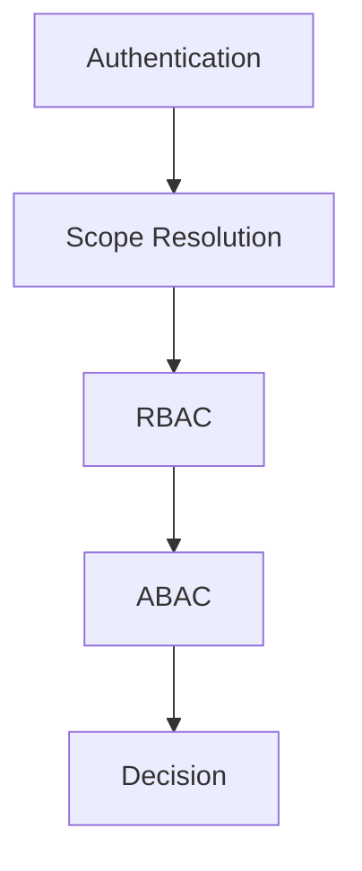

# 権限設計

---

# 0️⃣ 設計前提

| 項目 | 内容 |
| --- | --- |
| 権限モデル | Hybrid（RBAC + ABAC） |
| マルチテナント | あり |
| 認証方式 | JWT（本番: Cognito / dev: Magnito） |
| スコープ単位 | Tenant / Hackathon / Resource |
| MVP方針 | `Admin`、`Sponsor`、`Judge`、`Hacker` の 4 ロールを前提に、招待参加とスカウト送信に必要な権限制御を優先する |

補足:

- `Admin` はテナント管理者（契約者）を意味する。
- `Sponsor` は Tenant 単位で所属する。
- `Judge` と `Hacker` は Hackathon 単位で所属する。

---

# 1️⃣ 用語定義

| 用語 | 意味 |
| --- | --- |
| Subject | 操作主体。認証済みユーザー |
| Resource | 操作対象。Tenant、Hackathon、Invite、Scout、Membership など |
| Action | 操作内容。`create`、`read`、`update`、`delete`、`join`、`send`、`configure` など |
| Role | 主体に付与される役割。`Admin`、`Sponsor`、`Judge`、`Hacker` |
| Scope | 権限が有効な範囲。Tenant または Hackathon |
| Membership | ユーザーがどの Tenant / Hackathon にどの Role で属しているかを表す関係 |
| Sponsor Visibility Scope | `Sponsor` が閲覧可能な Hackathon 範囲。以降で登場する `SponsorScope` / `Sponsor Scope` は本用語と同義とする |
| Invite | 招待 URL + 参加パスワード + ロール + 有効期限を持つ参加導線 |

---

# 2️⃣ 権限レイヤー構造



判定の考え方:

1. 認証済みか
2. 対象 Tenant / Hackathon に対する所属または可視範囲があるか
3. ロール上、行為が許されているか
4. 動的条件を満たしているか
5. 最終的な allow / deny / not found を決める

---

# 3️⃣ RBAC 設計

## 3.1 ロール一覧

| ロール名 | 所属単位 | 説明 |
| --- | --- | --- |
| `Admin` | Tenant | テナント管理者。契約者として Tenant / Hackathon / 招待 / Sponsor 可視範囲を管理する |
| `Sponsor` | Tenant | スポンサー担当者。許可された Hackathon を閲覧し、スカウト送信を行う |
| `Judge` | Hackathon | 審査員。Hackathon に参加し、設定次第でスカウト送信を行う |
| `Hacker` | Hackathon | 出場者。Hackathon に参加し、スカウト受信設定を行う |

MVP の前提:

- グローバル `SUPER_ADMIN` は定義しない
- すべての権限は Tenant / Hackathon の所属と結びつけて評価する

## 3.2 ロール別の大枠権限

| Resource / Action | Admin | Sponsor | Judge | Hacker |
| --- | --- | --- | --- | --- |
| Tenant: read | allow | scoped allow | deny | deny |
| Tenant: create | allow | deny | deny | deny |
| Tenant: update | allow | deny | deny | deny |
| Hackathon: create | allow | deny | deny | deny |
| Hackathon: read | allow | scoped allow | membership allow | membership allow |
| Hackathon: update | allow | deny | deny | deny |
| Invite: create | allow | deny | deny | deny |
| Invite: reissue | allow | deny | deny | deny |
| Invite: revoke | allow | deny | deny | deny |
| Sponsor Visibility Scope: read/update | allow | deny | deny | deny |
| Scout: create/send | allow | allow | conditional allow | deny |
| Scout: receive | deny | deny | deny | allow |
| ScoutPreference: update | deny | deny | deny | allow |

補足:

- `Sponsor` の `Tenant: read` は、自分が所属する Tenant に限る
- `Judge` の `Scout: create/send` は RBAC 上は候補扱いで、ABAC で最終判定する
- `Admin` は実質的に Tenant 内全権だが、他 Tenant へ越境できない

## 3.3 RBAC 判定の基本

```pseudo
if not user.authenticated:
    deny(401)

membership = resolve_membership(user, target_scope)
if membership is None and not (
    user.role == 'Sponsor'
    and is_within_sponsor_visibility_scope(user, target_scope)
):
    deny(403 or 404)

if action not in role_allowed_actions[user.role]:
    deny(403)
```

---

# 4️⃣ スコープモデル

## 4.1 スコープ階層

```text
Tenant
└── Hackathon
    ├── Judge Membership
    ├── Hacker Membership
    └── Scouts
```

```text
Tenant
├── Admin Membership
├── Sponsor Membership
└── Sponsor Visibility Scope
    └── allowed_hackathon_ids[]
```

## 4.2 所属の考え方

- `Admin`: Tenant に所属
- `Sponsor`: Tenant に所属
- `Judge`: Hackathon に所属
- `Hacker`: Hackathon に所属

## 4.3 スポンサー可視範囲

`Sponsor` の閲覧可能範囲は、所属 Tenant 内でさらに絞る。

```json
{
  "subject.role": "Sponsor",
  "subject.tenant_id": "tenant_123",
  "subject.allowed_hackathon_ids": ["hack_1", "hack_2"]
}
```

この `allowed_hackathon_ids` は、テナント管理者である `Admin` が専用画面で管理する。

---

# 5️⃣ ABAC 設計

## 5.1 主な条件

| 条件名 | 説明 |
| --- | --- |
| tenant_match | Subject と Resource の Tenant が一致している |
| hackathon_membership | Subject が対象 Hackathon に所属している |
| sponsor_visible_scope | Sponsor に対象 Hackathon の閲覧権がある |
| invite_active | 招待が有効であり、無効化されておらず、期限内である |
| invite_role_match | 招待されたロールと参加ロールが一致している |
| feature_enabled | Tenant または Hackathon でスカウト機能が有効である |
| judge_send_enabled | Judge のスカウト送信権限が有効である |
| scout_opt_in | 対象 Hacker がスカウト受信を許可している |
| judge_data_isolated | Sponsor が審査情報へアクセスしない |

## 5.2 条件モデル

```json
{
  "subject.role": "Sponsor",
  "subject.tenant_id": "tenant_123",
  "subject.allowed_hackathon_ids": ["hack_1", "hack_2"],
  "resource.tenant_id": "tenant_123",
  "resource.hackathon_id": "hack_1",
  "resource.scout_opt_in": true,
  "resource.feature_enabled": true
}
```

## 5.3 判定順序

```pseudo
1. 認証確認
2. Tenant 境界確認
3. 所属または可視範囲確認
4. RBAC 判定
5. 招待・機能ON/OFF・opt-in などの ABAC 条件評価
6. allow / deny / not found 決定
```

---

# 6️⃣ 代表ルール

## 6.1 招待 URL 利用

```pseudo
if invite.revoked_at is not null:
    deny(403)

if now > invite.expires_at:
    deny(403)

if invite.password_hash does not match input:
    deny(403)

if invite.target_role != requested_role:
    deny(403)
```

## 6.2 Tenant 境界

```pseudo
if resource.tenant_id != subject.tenant_id:
    deny(403)
```

## 6.3 Sponsor の Hackathon 閲覧

```pseudo
if subject.role == Sponsor and resource.hackathon_id not in subject.allowed_hackathon_ids:
    deny(404)
```

## 6.4 Judge の送信権限

```pseudo
if subject.role == Judge and hackathon.judge_send_enabled != true:
    deny(403)
```

## 6.5 スカウト送信

```pseudo
if scout.feature_enabled != true:
    deny(403)

if target_hacker.scout_opt_in != true:
    deny(404)
```

## 6.6 審査情報の隔離

```pseudo
if subject.role == Sponsor and resource.type in ["judge_score", "judge_note"]:
    deny(403)
```

---

# 7️⃣ 権限マトリクス

## 7.1 Admin

| Action | Tenant | Hackathon | Invite | Sponsor Scope | Scout |
| --- | --- | --- | --- | --- | --- |
| read | allow | allow | allow | allow | allow |
| create | allow | allow | allow | allow | allow |
| update | allow | allow | allow | allow | allow |
| revoke | n/a | n/a | allow | n/a | n/a |

## 7.2 Sponsor

| Action | Tenant | Hackathon | Invite | Sponsor Scope | Scout |
| --- | --- | --- | --- | --- | --- |
| read | own tenant only | allowed only | deny | deny | own visible range only |
| create | deny | deny | deny | deny | allow |
| update | deny | deny | deny | deny | deny |

## 7.3 Judge

| Action | Tenant | Hackathon | Invite | Sponsor Scope | Scout |
| --- | --- | --- | --- | --- | --- |
| read | deny | membership only | deny | deny | conditional allow |
| create | deny | deny | deny | deny | conditional allow |
| update | deny | deny | deny | deny | deny |

## 7.4 Hacker

| Action | Tenant | Hackathon | Invite | Sponsor Scope | Scout |
| --- | --- | --- | --- | --- | --- |
| read | deny | membership only | deny | deny | receive only |
| create | deny | deny | deny | deny | deny |
| update | deny | deny | deny | deny | scout preference only |

---

# 8️⃣ Resource ごとの判定方針

## 8.1 Tenant

- `Admin`: 自分の Tenant を閲覧・更新できる
- `Sponsor`: 自分の所属 Tenant の基本情報のみ閲覧可能
- `Judge` / `Hacker`: Tenant 直接操作なし

## 8.2 Hackathon

- `Admin`: 配下 Hackathon を作成・更新できる
- `Sponsor`: 許可された Hackathon のみ閲覧可能
- `Judge` / `Hacker`: 自分の所属 Hackathon のみ閲覧可能

## 8.3 Invite

- `Admin` のみ発行・有効期限設定・再発行・無効化ができる
- 他ロールは Invite 管理画面にアクセスできない

## 8.4 Scout

- `Sponsor`: 可視範囲内かつ機能有効な Hackathon に対して送信可能
- `Judge`: 所属 Hackathon かつ送信権限有効時のみ送信可能
- `Hacker`: 受信設定のみ更新可能

---

# 9️⃣ API レイヤー統合方針

```typescript
function authorize(subject, action, resource, context) {
  if (!isAuthenticated(subject)) throw Unauthorized

  if (!tenantMatch(subject, resource)) throw Forbidden

  if (!rbacAllow(subject.role, action, resource.type)) throw Forbidden

  if (!abacAllow(subject, action, resource, context)) {
    if (context.shouldHideExistence) throw NotFound
    throw Forbidden
  }
}
```

## 9.1 ステータスコード方針

| ケース | 返す値 |
| --- | --- |
| 未認証 | `401 Unauthorized` |
| 権限不足だが存在を隠す必要がない | `403 Forbidden` |
| opt-out 対象、Sponsor 可視範囲外、存在を隠したい対象 | `404 Not Found` |

---

# 🔟 データモデル連携

| ルール | 参照項目（DB / JWT / コンテキスト） |
| --- | --- |
| Tenant 境界 | `resource.tenant_id`, `subject.tenant_id` |
| Hackathon 所属 | `hackathon_memberships` |
| Sponsor 可視範囲 | DB: `sponsor_visible_hackathons` / JWT・コンテキスト: Sponsor Visibility Scope（`allowed_hackathon_ids`） |
| Invite 有効性 | `invites.expires_at`, `invites.revoked_at`, `invites.password_hash` |
| スカウト受信可否 | `hackathon_memberships.is_scout_allowed` |
| Judge 送信権限 | `hackathons.judge_send_enabled` または同等設定 |
| 機能 ON / OFF | `tenants.scout_enabled`, `hackathons.scout_enabled` |

---

# 1️⃣1️⃣ ログ設計

## 11.1 認可評価ログ

| フィールド | 内容 |
| --- | --- |
| user_id | 操作主体 |
| role | 評価時のロール |
| tenant_id | 所属 Tenant |
| hackathon_id | 対象 Hackathon |
| action | 試行した操作 |
| resource_type | Resource 種別 |
| resource_id | Resource ID |
| decision | allow / deny / not_found |
| reason | tenant_mismatch / invite_expired / scope_denied / opt_out など |
| timestamp | 評価時刻 |

## 11.2 監査ログ

最低限保存する操作:

- 招待 URL 発行
- 招待 URL 再発行
- 招待 URL 無効化
- Sponsor 可視範囲変更
- スカウト送信
- 機能 ON / OFF 変更
- Judge 送信権限変更

---

# 1️⃣2️⃣ フロントエンド制御

| パターン | 説明 |
| --- | --- |
| 非表示 | 権限のないメニューやボタンを表示しない |
| 無効化 | 見せるが押せない状態を示す |
| 警告 | 有効期限切れ、権限不足、招待無効などを案内する |

補足:

- フロントは UX 制御のみを担う
- 最終判定は必ずサーバー側で行う
- `Sponsor` に見せない Hackathon は、一覧からも詳細からも隠す
