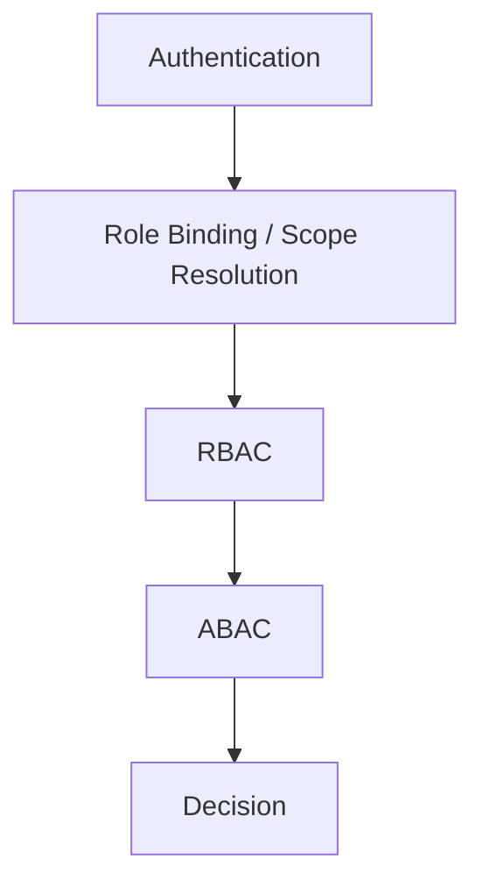

# 権限設計

---

# 0️⃣ 設計前提

| 項目 | 内容 |
| --- | --- |
| 権限モデル | Hybrid（RBAC + ABAC） |
| マルチテナント | あり |
| 認証方式 | JWT（`APP_ENV=dev`: Magnito / `APP_ENV=prod`: Cognito） |
| 境界防御 | アプリケーション側の RBAC + ABAC を主とし、`prod` では PostgreSQL RLS を防御層として併用する |
| スコープ単位 | Global / Tenant / Hackathon / Resource |
| MVP方針 | `PlatformAdmin`、`TenantAdmin`、`HackathonOrganizer`、`Sponsor`、`Judge`、`Hacker` の 6 ロールを前提に、Tenant 立ち上げ、招待参加、Hackathon 運営、スカウト送信に必要な権限制御を優先する |

補足:

- `PlatformAdmin` はプロバイダー側の最小グローバル権限
- `TenantAdmin` は Tenant 単位の上位権限
- `HackathonOrganizer` は Hackathon 単位の運営権限
- 管理ロールと送信ロールは分離し、スカウト送信は `Sponsor` または送信権限を持つ `Judge` でのみ評価する
- 同一ユーザーが複数ロールを持つことを許容する

---

# 1️⃣ 用語定義

| 用語 | 意味 |
| --- | --- |
| Subject | 操作主体。認証済みユーザー |
| Resource | 操作対象。Tenant、Hackathon、Invite、Scout、Membership など |
| Action | 操作内容。`create`、`read`、`update`、`delete`、`join`、`send`、`configure` など |
| Role | 主体に付与される役割。`PlatformAdmin`、`TenantAdmin`、`HackathonOrganizer`、`Sponsor`、`Judge`、`Hacker` |
| Scope | 権限が有効な範囲。Global、Tenant、Hackathon |
| Role Binding | ユーザーに対して `role + scope` で紐づく権限付与情報 |
| Membership | Hackathon または Tenant への所属関係 |
| Sponsor Visibility Scope | `Sponsor` が閲覧可能な Hackathon 範囲 |
| Invite | 招待 URL + 参加パスワード + ロール + 有効期限を持つ参加導線 |
| Active Context | UI 上で現在利用中のロール / スコープ。最終認可は常にサーバー側で再評価する |

---

# 2️⃣ 権限レイヤー構造



判定の考え方:

1. 認証済みか
2. どの `role + scope` を持っているか
3. ロール上、その行為が許されているか
4. 招待の有効性、Sponsor 可視範囲、スカウト ON / OFF、opt-in などの条件を満たすか
5. 最終的な allow / deny / not found を決める

---

# 3️⃣ スコープ付きロールモデル

## 3.1 ロール一覧

| ロール名 | スコープ | 説明 |
| --- | --- | --- |
| `PlatformAdmin` | Global | Tenant 作成と初期セットアップを行う |
| `TenantAdmin` | Tenant | 自 Tenant 配下の Hackathon、Sponsor、運営設定を管理する |
| `HackathonOrganizer` | Hackathon | 担当 Hackathon の招待と Hackathon 単位設定を管理する |
| `Sponsor` | Tenant | 自 Tenant に所属し、許可された Hackathon を閲覧・送信する |
| `Judge` | Hackathon | 担当 Hackathon で審査し、設定次第で送信する |
| `Hacker` | Hackathon | 参加者として所属し、スカウト受信設定を管理する |

## 3.2 複数ロール所持

- 同一ユーザーが複数の `Role Binding` を持つことを許容する
- 同一 Tenant 内で `TenantAdmin` と `HackathonOrganizer` を両方持てる
- 同一ユーザーが `TenantAdmin` と `Sponsor`、`HackathonOrganizer` と `Judge` のように管理ロールと送信ロールを兼務できる
- 同一ユーザーが複数 Hackathon に対して `HackathonOrganizer` や `Judge` を持てる
- `PlatformAdmin` を持っていても、Tenant / Hackathon の業務ロールは自動付与しない

## 3.3 TenantAdmin と HackathonOrganizer の関係

- `TenantAdmin` は自 Tenant 配下のすべての Hackathon に対して、`HackathonOrganizer` 相当の上位運営権限を持つ
- `HackathonOrganizer` は自分に割り当てられた Hackathon のみ操作できる
- `HackathonOrganizer` は Sponsor 可視範囲や Tenant 全体設定は変更できない

---

# 4️⃣ RBAC 設計

## 4.1 ロール別の大枠権限

| Resource / Action | PlatformAdmin | TenantAdmin | HackathonOrganizer | Sponsor | Judge | Hacker |
| --- | --- | --- | --- | --- | --- | --- |
| Tenant: create | allow | deny | deny | deny | deny | deny |
| Tenant: read | limited allow | own tenant allow | deny | own tenant scoped allow | deny | deny |
| Tenant: update | limited allow | own tenant allow | deny | deny | deny | deny |
| TenantAdminAssignment: create/update | allow | deny | deny | deny | deny | deny |
| Hackathon: create | deny | allow | deny | deny | deny | deny |
| Hackathon: read | deny | allow | assigned only | allowed only | membership only | membership only |
| Hackathon: update | deny | allow | assigned only | deny | deny | deny |
| HackathonOrganizerAssignment: create/update | deny | allow | deny | deny | deny | deny |
| Invite: create/reissue/revoke | deny | sponsor invite allow / hackathon override allow | assigned hackathon only | deny | deny | deny |
| SponsorScope: read/update | deny | allow | deny | deny | deny | deny |
| Scout: create/send | deny | deny | deny | allow | conditional allow | deny |
| Scout: receive | deny | deny | deny | deny | deny | allow |
| ScoutPreference: update | deny | deny | deny | deny | deny | allow |

補足:

- `PlatformAdmin` は Tenant 作成と初期管理が中心であり、Scout 業務操作は行わない
- `TenantAdmin` は Tenant 内の上位運営者だが、管理ロール単体では Scout 送信しない
- `HackathonOrganizer` は運営権限であり、Scout の送信主体ではない
- スカウト送信したいユーザーは、別途 `Sponsor` または `Judge` の `Role Binding` を持つ必要がある
- `Judge` の Scout 送信は RBAC 上は候補扱いで、ABAC で最終判定する

## 4.2 RBAC 判定の基本

```pseudo
bindings = resolve_role_bindings(user)
if bindings is empty:
    deny(401 or 403)

if no binding allows action on target scope:
    deny(403)
```

---

# 5️⃣ スコープモデル

## 5.1 スコープ階層

```text
Global
└── Tenant
    └── Hackathon
        ├── Judge Membership
        ├── Hacker Membership
        └── Scouts
```

## 5.2 Role Binding のイメージ

```json
[
  { "role": "TenantAdmin", "scope_type": "tenant", "scope_id": "tenant_a" },
  { "role": "HackathonOrganizer", "scope_type": "hackathon", "scope_id": "hackathon_x" },
  { "role": "Judge", "scope_type": "hackathon", "scope_id": "hackathon_y" }
]
```

## 5.3 Sponsor 可視範囲

`Sponsor` は Tenant に所属したうえで、さらに閲覧可能 Hackathon を限定する。

```json
{
  "subject.role": "Sponsor",
  "subject.tenant_id": "tenant_123",
  "subject.allowed_hackathon_ids": ["hack_1", "hack_2"]
}
```

この `allowed_hackathon_ids` は、`TenantAdmin` が専用画面で管理する。

---

# 6️⃣ ABAC 設計

## 6.1 主な条件

| 条件名 | 説明 |
| --- | --- |
| tenant_match | Subject と Resource の Tenant が一致している |
| hackathon_membership | Subject が対象 Hackathon に所属している |
| organizer_binding_exists | Subject が対象 Hackathon の `HackathonOrganizer` を持つ |
| tenant_admin_override | Subject が対象 Tenant の `TenantAdmin` を持つ |
| sponsor_visible_scope | Sponsor に対象 Hackathon の閲覧権がある |
| invite_active | 招待が有効であり、無効化されておらず、期限内である |
| invite_role_match | 招待されたロールと参加ロールが一致している |
| scout_enabled | Hackathon のスカウト機能が有効である |
| judge_send_enabled | Judge のスカウト送信権限が有効である |
| scout_opt_in | 対象 Hacker がスカウト受信を許可している |
| judge_data_isolated | Sponsor が審査情報へアクセスしない |

## 6.2 条件モデル

```json
{
  "subject.role_bindings": [
    { "role": "TenantAdmin", "scope_type": "tenant", "scope_id": "tenant_123" },
    { "role": "HackathonOrganizer", "scope_type": "hackathon", "scope_id": "hack_1" }
  ],
  "subject.allowed_hackathon_ids": ["hack_1", "hack_2"],
  "resource.tenant_id": "tenant_123",
  "resource.hackathon_id": "hack_1",
  "resource.scout_opt_in": true,
  "resource.scout_enabled": true
}
```

## 6.3 判定順序

```pseudo
1. 認証確認
2. Role Binding と Scope 解決
3. RBAC 判定
4. Tenant / Hackathon 境界確認
5. 招待・可視範囲・機能ON/OFF・opt-in などの ABAC 条件評価
6. allow / deny / not found 決定
```

---

# 7️⃣ 代表ルール

## 7.1 Tenant 作成

```pseudo
if subject has PlatformAdmin:
    allow create tenant
else:
    deny(403)
```

## 7.2 TenantAdmin の上位権限

```pseudo
if subject has TenantAdmin on resource.tenant_id:
    allow hackathon management under that tenant
```

## 7.3 HackathonOrganizer の範囲制限

```pseudo
if subject has HackathonOrganizer on resource.hackathon_id:
    allow hackathon settings and invite management
else:
    deny(403)
```

## 7.4 招待 URL 利用

```pseudo
if invite.revoked_at is not null:
    deny(403)

if now > invite.expires_at:
    deny(403)

if invite.password_hash does not match input:
    deny(403)

if invite.target_role != requested_role:
    deny(403)
```

## 7.5 Sponsor の Hackathon 閲覧

```pseudo
if subject.role == Sponsor and resource.hackathon_id not in subject.allowed_hackathon_ids:
    deny(404)
```

## 7.6 Judge の送信権限

```pseudo
if subject.role == Judge and hackathon.judge_send_enabled != true:
    deny(403)
```

## 7.7 スカウト送信

```pseudo
if subject.active_role not in ["Sponsor", "Judge"]:
    deny(403)

if subject.active_role == "Sponsor" and resource.hackathon_id not in subject.allowed_hackathon_ids:
    deny(404)

if hackathon.scout_enabled != true:
    deny(403)

if target_hacker.scout_opt_in != true:
    deny(404)
```

## 7.8 審査情報の隔離

```pseudo
if subject.role == Sponsor and resource.type in ["judge_score", "judge_note"]:
    deny(403)
```

---

# 8️⃣ 権限マトリクス

## 8.1 PlatformAdmin

| Action | Tenant | Hackathon | Invite | Sponsor Scope | Scout |
| --- | --- | --- | --- | --- | --- |
| read | limited allow | deny by default | deny | deny | deny |
| create | allow | deny | deny | deny | deny |
| update | allow tenant lifecycle only | deny | deny | deny | deny |

## 8.2 TenantAdmin

| Action | Tenant | Hackathon | Invite | Sponsor Scope | Scout |
| --- | --- | --- | --- | --- | --- |
| read | own tenant only | all hackathons under own tenant | sponsor invite allow | allow | deny |
| create | own tenant settings only | allow | sponsor invite allow / own-tenant hackathon invite override allow | allow | deny |
| update | own tenant only | allow | sponsor invite allow / own-tenant hackathon invite override allow | allow | deny |

## 8.3 HackathonOrganizer

| Action | Tenant | Hackathon | Invite | Sponsor Scope | Scout |
| --- | --- | --- | --- | --- | --- |
| read | deny | assigned only | assigned hackathon only | deny | deny |
| create | deny | deny | assigned hackathon only | deny | deny |
| update | deny | assigned hackathon settings only | assigned hackathon only | deny | deny |

## 8.4 Sponsor

| Action | Tenant | Hackathon | Invite | Sponsor Scope | Scout |
| --- | --- | --- | --- | --- | --- |
| read | own tenant only | allowed only | deny | deny | own visible range only |
| create | deny | deny | deny | deny | allow |
| update | deny | deny | deny | deny | deny |

## 8.5 Judge

| Action | Tenant | Hackathon | Invite | Sponsor Scope | Scout |
| --- | --- | --- | --- | --- | --- |
| read | deny | membership only | deny | deny | conditional allow |
| create | deny | deny | deny | deny | conditional allow |
| update | deny | deny | deny | deny | deny |

## 8.6 Hacker

| Action | Tenant | Hackathon | Invite | Sponsor Scope | Scout |
| --- | --- | --- | --- | --- | --- |
| read | deny | membership only | deny | deny | receive only |
| create | deny | deny | deny | deny | deny |
| update | deny | deny | deny | deny | scout preference only |

---

# 9️⃣ Resource ごとの判定方針

## 9.1 Tenant

- `PlatformAdmin`: Tenant 作成と状態管理のみ
- `TenantAdmin`: 自分の Tenant を閲覧・更新できる
- `Sponsor`: 自分の所属 Tenant の限定的情報のみ閲覧可能
- `HackathonOrganizer` / `Judge` / `Hacker`: Tenant 直接操作なし

## 9.2 Hackathon

- `TenantAdmin`: 配下 Hackathon を作成・更新できる
- `HackathonOrganizer`: 割り当てられた Hackathon を管理できる
- `Sponsor`: 許可された Hackathon のみ閲覧可能
- `Judge` / `Hacker`: 自分の所属 Hackathon のみ閲覧可能

## 9.3 Invite

- `PlatformAdmin`: 操作しない
- `TenantAdmin`: Sponsor 招待を管理できる
- `HackathonOrganizer`: 自分の Hackathon 招待を管理できる
- `TenantAdmin`: 自 Tenant 配下 Hackathon の Invite に対して上位権限を持つ

## 9.4 Scout

- `PlatformAdmin`: 操作しない
- `TenantAdmin`: 設定変更や監査の主体になり得るが、送信主体ではない
- `Sponsor`: 可視範囲内かつ機能有効な Hackathon に対して送信可能
- `Judge`: 所属 Hackathon かつ送信権限有効時のみ送信可能
- `Hacker`: 受信設定のみ更新可能
- `HackathonOrganizer`: Scout の送信主体ではなく、機能設定主体

---

# 🔟 API レイヤー統合方針

```typescript
function authorize(subject, action, resource, context) {
  if (!isAuthenticated(subject)) throw Unauthorized

  const bindings = resolveRoleBindings(subject)
  if (!bindings.length) throw Forbidden

  if (!rbacAllow(bindings, action, resource.type, resource.scope)) {
    throw Forbidden
  }

  if (!abacAllow(subject, action, resource, context)) {
    if (context.shouldHideExistence) throw NotFound
    throw Forbidden
  }
}
```

## 10.1 ステータスコード方針

| ケース | 返す値 |
| --- | --- |
| 未認証 | `401 Unauthorized` |
| 権限不足だが存在を隠す必要がない | `403 Forbidden` |
| Sponsor 可視範囲外、opt-out 対象、存在を隠したい対象 | `404 Not Found` |

---

# 1️⃣1️⃣ データモデル連携

| ルール | 参照項目（DB / JWT / コンテキスト） |
| --- | --- |
| Role Binding | `user_role_bindings` |
| Tenant 境界 | `resource.tenant_id`, `binding.scope_id` |
| Hackathon 所属 | `hackathon_memberships` |
| Sponsor 可視範囲 | `sponsor_visible_hackathons` |
| Invite 有効性 | `invites.expires_at`, `invites.revoked_at`, `invites.password_hash`, `invites.target_role` |
| スカウト受信可否 | `hackathon_memberships.is_scout_allowed` |
| Judge 送信権限 | `hackathons.judge_send_enabled` |
| スカウト ON / OFF | `hackathons.scout_enabled` |

---

# 1️⃣2️⃣ ログ設計

## 12.1 認可評価ログ

| フィールド | 内容 |
| --- | --- |
| user_id | 操作主体 |
| role_bindings | 評価時に持っていたロール一覧 |
| active_context | UI 上の利用中コンテキスト |
| tenant_id | 対象 Tenant |
| hackathon_id | 対象 Hackathon |
| action | 試行した操作 |
| resource_type | Resource 種別 |
| resource_id | Resource ID |
| decision | allow / deny / not_found |
| reason | invite_expired / scope_denied / opt_out / role_missing など |
| timestamp | 評価時刻 |

## 12.2 監査ログ

最低限保存する操作:

- Tenant 作成
- 初期 TenantAdmin 割り当て
- Hackathon 作成
- HackathonOrganizer 割り当て
- Sponsor 招待 URL 発行 / 再発行 / 無効化
- Hackathon 招待 URL 発行 / 再発行 / 無効化
- Sponsor 表示範囲変更
- Hackathon のスカウト ON / OFF 変更
- Judge 送信権限変更
- スカウト送信

---

# 1️⃣3️⃣ フロントエンド制御

| パターン | 説明 |
| --- | --- |
| 非表示 | 権限のないメニューやボタンを表示しない |
| 無効化 | 見せるが押せない状態を示す |
| コンテキスト切替 | 複数ロール所持時に利用中スコープを切り替える |
| 警告 | 有効期限切れ、権限不足、招待無効などを案内する |

補足:

- フロントは UX 制御のみを担う
- 最終判定は必ずサーバー側で行う
- `Sponsor` に見せない Hackathon は一覧からも詳細からも隠す
- `PlatformAdmin`、`TenantAdmin`、`HackathonOrganizer` で表示メニューを分ける
