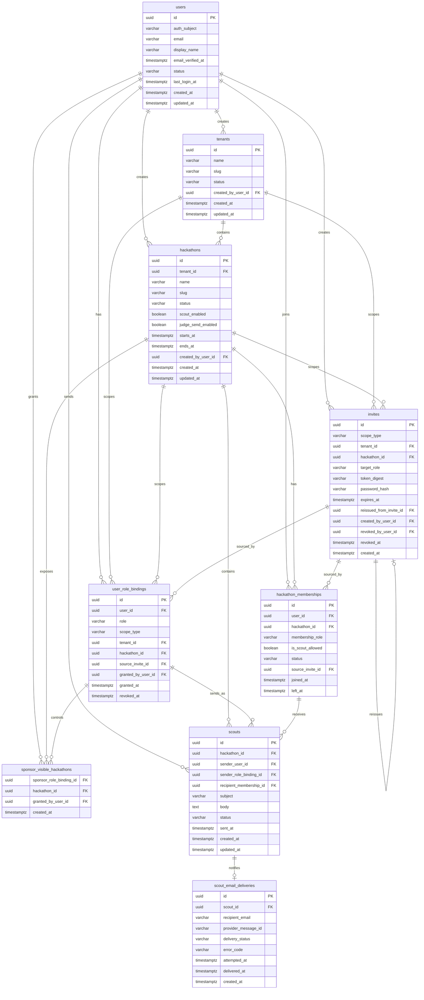

# ERD設計

---

## 0️⃣ 設計前提

| 項目 | 内容 |
| --- | --- |
| 対象プロダクト | HackTrack。`Tenant > Hackathon` 階層を持つマルチテナント型ハッカソン運営基盤 |
| 認証前提 | 認証プロバイダは環境変数で切り替える。DB には保持せず、アプリ側ではローカル `users` を保持する |
| 権限モデル | Hybrid（RBAC + ABAC）。認可の主データは `user_role_bindings` |
| 境界防御 | 認可はアプリケーションを主とし、`prod` の PostgreSQL では tenant スコープ主要テーブルに RLS を併用する |
| ID戦略 | `UUID` を前提とする |
| 時刻型 | `timestamptz` を前提とする |
| 論理削除方針 | 汎用 `deleted_at` は持たず、`status`、`revoked_at`、`left_at` など状態遷移で扱う |
| 招待方針 | 招待 URL は共有リンク型のマルチユース招待を前提とし、対象ロールと有効期限を持つ |
| 監査方針 | 誰が付与し、どの招待から参加したかを追えるよう、`granted_by_user_id` / `source_invite_id` を保持する |

補足:

- `PlatformAdmin` は Global スコープのロールとして扱う。
- `TenantAdmin` / `HackathonOrganizer` は管理ロールであり、送信主体ではない。
- スカウト送信主体は `Sponsor` または送信権限を持つ `Judge` である。

---

## 1️⃣ P0 テーブル一覧

| ドメイン | テーブル名 | 役割 | Phase |
| --- | --- | --- | --- |
| Identity | `users` | アプリ内ユーザー主体 | P0 |
| Tenant | `tenants` | 開催団体の管理単位 | P0 |
| Hackathon | `hackathons` | Tenant 配下のイベント単位 | P0 |
| Authorization | `user_role_bindings` | `role + scope` を保持する権限付与の正本 | P0 |
| Invite | `invites` | 参加 URL、対象ロール、参加パスワード、有効期限を持つ招待 | P0 |
| Participation | `hackathon_memberships` | `Judge` / `Hacker` の Hackathon 参加情報 | P0 |
| Visibility | `sponsor_visible_hackathons` | `Sponsor` ごとの閲覧可能 Hackathon 範囲 | P0 |
| Core Feature | `scouts` | スカウト送信の本体 | P0 |
| Notification | `scout_email_deliveries` | スカウト通知メールの送達結果 | P0 |

将来拡張候補:

- `tenant_mail_templates` : Tenant ごとのメール文面設定
- `scout_templates` : スカウト定型文
- `scout_status_events` : ステータス遷移の履歴

---

## 2️⃣ モデル方針

### 2.1 `user_role_bindings` を認可の正本にする

- すべての権限は `user_role_bindings` で評価する。
- `PlatformAdmin`、`TenantAdmin`、`HackathonOrganizer`、`Sponsor`、`Judge`、`Hacker` を同じテーブルで扱う。
- 同一ユーザーが複数ロール、複数スコープを持てるようにする。

### 2.2 `hackathon_memberships` は業務上の参加情報を持つ

- `Judge` / `Hacker` の参加は、認可用の `user_role_bindings` と、業務用の `hackathon_memberships` を併用する。
- `is_scout_allowed` のような Hackathon 単位の属性は `hackathon_memberships` に持たせる。

### 2.3 `Sponsor` の閲覧範囲は別テーブルで制御する

- `Sponsor` は Tenant スコープで参加する。
- そのうえで、表示可能な Hackathon だけを `sponsor_visible_hackathons` で絞る。
- 可視範囲は `Sponsor` の `user_role_bindings.id` に紐づける。

### 2.4 招待は 1 テーブルで統一する

- `Sponsor` 向けは Tenant スコープ招待
- `Judge` / `Hacker` 向けは Hackathon スコープ招待
- 再発行は `reissued_from_invite_id` で追跡する

---

## 3️⃣ ERD

---

## 4️⃣ テーブル定義

### 4.1 `users`

アプリ側で保持するユーザー正本。認証プロバイダの選択は環境変数で切り替え、DB には保持しない。アプリは受け取った `sub` を `auth_subject` として扱う。

| カラム | 型 | 制約 | 説明 |
| --- | --- | --- | --- |
| `id` | UUID | PK | アプリ内ユーザー ID |
| `auth_subject` | VARCHAR | UNIQUE NOT NULL | IdP 上の subject |
| `email` | VARCHAR | UNIQUE NOT NULL | ログインメールアドレス |
| `display_name` | VARCHAR | NOT NULL | 画面表示用の氏名 / 表示名 |
| `email_verified_at` | TIMESTAMPTZ | NULL | メール認証完了日時 |
| `status` | VARCHAR | NOT NULL | `active` / `inactive` |
| `last_login_at` | TIMESTAMPTZ | NULL | 最終ログイン日時 |
| `created_at` | TIMESTAMPTZ | NOT NULL | 作成日時 |
| `updated_at` | TIMESTAMPTZ | NOT NULL | 更新日時 |

### 4.2 `tenants`

開催団体や契約単位を表す。

| カラム | 型 | 制約 | 説明 |
| --- | --- | --- | --- |
| `id` | UUID | PK | Tenant ID |
| `name` | VARCHAR | NOT NULL | Tenant 名 |
| `slug` | VARCHAR | UNIQUE NOT NULL | URL 用識別子 |
| `status` | VARCHAR | NOT NULL | `active` / `inactive` |
| `created_by_user_id` | UUID | FK `users.id` | 作成者。通常は `PlatformAdmin` |
| `created_at` | TIMESTAMPTZ | NOT NULL | 作成日時 |
| `updated_at` | TIMESTAMPTZ | NOT NULL | 更新日時 |

### 4.3 `hackathons`

Tenant 配下の開催回やイベント単位を表す。

| カラム | 型 | 制約 | 説明 |
| --- | --- | --- | --- |
| `id` | UUID | PK | Hackathon ID |
| `tenant_id` | UUID | FK `tenants.id` NOT NULL | 所属 Tenant |
| `name` | VARCHAR | NOT NULL | Hackathon 名 |
| `slug` | VARCHAR | NOT NULL | Tenant 内識別子 |
| `status` | VARCHAR | NOT NULL | `draft` / `active` / `closed` / `archived` |
| `scout_enabled` | BOOLEAN | NOT NULL | スカウト機能 ON / OFF |
| `judge_send_enabled` | BOOLEAN | NOT NULL | Judge の送信可否 |
| `starts_at` | TIMESTAMPTZ | NULL | 開始日時 |
| `ends_at` | TIMESTAMPTZ | NULL | 終了日時 |
| `created_by_user_id` | UUID | FK `users.id` | 作成者。通常は `TenantAdmin` |
| `created_at` | TIMESTAMPTZ | NOT NULL | 作成日時 |
| `updated_at` | TIMESTAMPTZ | NOT NULL | 更新日時 |

推奨制約:

- UNIQUE (`tenant_id`, `slug`)

### 4.4 `user_role_bindings`

認可評価の正本。全ロールを共通形式で保持する。

| カラム | 型 | 制約 | 説明 |
| --- | --- | --- | --- |
| `id` | UUID | PK | Role Binding ID |
| `user_id` | UUID | FK `users.id` NOT NULL | 権限保持ユーザー |
| `role` | VARCHAR | NOT NULL | `platform_admin` / `tenant_admin` / `hackathon_organizer` / `sponsor` / `judge` / `hacker` |
| `scope_type` | VARCHAR | NOT NULL | `global` / `tenant` / `hackathon` |
| `tenant_id` | UUID | FK `tenants.id` NULL | Tenant スコープ時のみ使用 |
| `hackathon_id` | UUID | FK `hackathons.id` NULL | Hackathon スコープ時のみ使用 |
| `source_invite_id` | UUID | FK `invites.id` NULL | 招待参加由来ならその Invite |
| `granted_by_user_id` | UUID | FK `users.id` NULL | 手動付与した管理者 |
| `granted_at` | TIMESTAMPTZ | NOT NULL | 付与日時 |
| `revoked_at` | TIMESTAMPTZ | NULL | 剥奪日時 |

推奨制約:

- UNIQUE (`user_id`, `role`, `scope_type`, `tenant_id`, `hackathon_id`)
- `role` と `scope_type` の組み合わせを制限する

許容組み合わせ:

| role | scope_type |
| --- | --- |
| `platform_admin` | `global` |
| `tenant_admin` | `tenant` |
| `sponsor` | `tenant` |
| `hackathon_organizer` | `hackathon` |
| `judge` | `hackathon` |
| `hacker` | `hackathon` |

### 4.5 `invites`

招待 URL と参加パスワードの正本。MVP では複数人が利用できる共有リンクを前提にする。

| カラム | 型 | 制約 | 説明 |
| --- | --- | --- | --- |
| `id` | UUID | PK | Invite ID |
| `scope_type` | VARCHAR | NOT NULL | `tenant` / `hackathon` |
| `tenant_id` | UUID | FK `tenants.id` NULL | Sponsor 招待時に使用 |
| `hackathon_id` | UUID | FK `hackathons.id` NULL | Judge / Hacker 招待時に使用 |
| `target_role` | VARCHAR | NOT NULL | `sponsor` / `judge` / `hacker` |
| `token_digest` | VARCHAR | UNIQUE NOT NULL | URL トークンのダイジェスト |
| `password_hash` | VARCHAR | NOT NULL | 参加パスワードのハッシュ |
| `expires_at` | TIMESTAMPTZ | NOT NULL | 有効期限 |
| `reissued_from_invite_id` | UUID | FK `invites.id` NULL | 再発行元 Invite |
| `created_by_user_id` | UUID | FK `users.id` NOT NULL | 発行者 |
| `revoked_by_user_id` | UUID | FK `users.id` NULL | 無効化したユーザー |
| `revoked_at` | TIMESTAMPTZ | NULL | 無効化日時 |
| `created_at` | TIMESTAMPTZ | NOT NULL | 発行日時 |

推奨制約:

- `target_role = sponsor` のとき `scope_type = tenant`
- `target_role IN (judge, hacker)` のとき `scope_type = hackathon`

### 4.6 `hackathon_memberships`

Hackathon 参加の業務正本。`Judge` / `Hacker` を対象にし、`Hacker` のスカウト受信可否を持つ。

| カラム | 型 | 制約 | 説明 |
| --- | --- | --- | --- |
| `id` | UUID | PK | Membership ID |
| `user_id` | UUID | FK `users.id` NOT NULL | 参加ユーザー |
| `hackathon_id` | UUID | FK `hackathons.id` NOT NULL | 所属 Hackathon |
| `membership_role` | VARCHAR | NOT NULL | `judge` / `hacker` |
| `is_scout_allowed` | BOOLEAN | NOT NULL | `Hacker` の受信可否。`Judge` では未使用または固定値 |
| `status` | VARCHAR | NOT NULL | `active` / `withdrawn` |
| `source_invite_id` | UUID | FK `invites.id` NULL | 招待参加由来の Invite |
| `joined_at` | TIMESTAMPTZ | NOT NULL | 参加日時 |
| `left_at` | TIMESTAMPTZ | NULL | 離脱日時 |

推奨制約:

- UNIQUE (`user_id`, `hackathon_id`, `membership_role`)

### 4.7 `sponsor_visible_hackathons`

`Sponsor` に見せる Hackathon 範囲を保持する ABAC 用テーブル。

| カラム | 型 | 制約 | 説明 |
| --- | --- | --- | --- |
| `sponsor_role_binding_id` | UUID | FK `user_role_bindings.id` | `role = sponsor` の binding |
| `hackathon_id` | UUID | FK `hackathons.id` | 表示許可する Hackathon |
| `granted_by_user_id` | UUID | FK `users.id` NOT NULL | 設定者。通常は `TenantAdmin` |
| `created_at` | TIMESTAMPTZ | NOT NULL | 設定日時 |

推奨制約:

- PK (`sponsor_role_binding_id`, `hackathon_id`)
- `hackathon.tenant_id` と `sponsor_role_binding.tenant_id` の一致を保証する

### 4.8 `scouts`

スカウト送信の業務正本。送信者がどの role binding で送ったかを保持する。

| カラム | 型 | 制約 | 説明 |
| --- | --- | --- | --- |
| `id` | UUID | PK | Scout ID |
| `hackathon_id` | UUID | FK `hackathons.id` NOT NULL | 対象 Hackathon |
| `sender_user_id` | UUID | FK `users.id` NOT NULL | 送信者ユーザー |
| `sender_role_binding_id` | UUID | FK `user_role_bindings.id` NOT NULL | `Sponsor` または `Judge` の binding |
| `recipient_membership_id` | UUID | FK `hackathon_memberships.id` NOT NULL | 対象 `Hacker` |
| `subject` | VARCHAR | NOT NULL | 件名 |
| `body` | TEXT | NOT NULL | 本文 |
| `status` | VARCHAR | NOT NULL | `sent` / `delivery_failed` / `canceled` |
| `sent_at` | TIMESTAMPTZ | NULL | 送信日時 |
| `created_at` | TIMESTAMPTZ | NOT NULL | 作成日時 |
| `updated_at` | TIMESTAMPTZ | NOT NULL | 更新日時 |

推奨制約:

- `sender_role_binding.role` は `sponsor` または `judge`
- `recipient_membership.membership_role` は `hacker`
- `scouts.hackathon_id` と `recipient_membership.hackathon_id` の一致を保証する

### 4.9 `scout_email_deliveries`

スカウト通知メールの送達結果を保持する。Mailpit / SES のどちらでも同じ概念で扱う。

| カラム | 型 | 制約 | 説明 |
| --- | --- | --- | --- |
| `id` | UUID | PK | Delivery ID |
| `scout_id` | UUID | FK `scouts.id` NOT NULL | 対象 Scout |
| `recipient_email` | VARCHAR | NOT NULL | 送達先メールアドレス |
| `provider_message_id` | VARCHAR | NULL | SES / Mailpit 側のメッセージ ID |
| `delivery_status` | VARCHAR | NOT NULL | `attempted` / `sent` / `failed` |
| `error_code` | VARCHAR | NULL | 失敗時のエラーコード |
| `attempted_at` | TIMESTAMPTZ | NOT NULL | 送信試行日時 |
| `delivered_at` | TIMESTAMPTZ | NULL | 送達確認日時 |
| `created_at` | TIMESTAMPTZ | NOT NULL | レコード作成日時 |

推奨制約:

- MVP では 1 Scout に対して 1 Delivery を前提に UNIQUE (`scout_id`)

---

## 5️⃣ 主要リレーションの読み方

### 5.1 Tenant 作成

1. `PlatformAdmin` が `tenants` を作成する
2. 初期 `TenantAdmin` の `user_role_bindings` を作る

### 5.2 Hackathon 作成

1. `TenantAdmin` が `hackathons` を作成する
2. 必要に応じて `HackathonOrganizer` の `user_role_bindings` を作る

### 5.3 Sponsor 参加

1. `TenantAdmin` が `invites` を作成する
2. `Sponsor` が参加すると `user_role_bindings(role=sponsor, scope=tenant)` を作る
3. `TenantAdmin` が `sponsor_visible_hackathons` を設定する

### 5.4 Judge / Hacker 参加

1. `HackathonOrganizer` または `TenantAdmin` が `invites` を作成する
2. 参加時に `user_role_bindings` を作る
3. 同時に `hackathon_memberships` を作る

### 5.5 スカウト送信

1. `Sponsor` または `Judge` が `scouts` を作成する
2. 通知送信結果を `scout_email_deliveries` に記録する

---

## 6️⃣ DB 制約とアプリケーション制約

### DB 制約で担保したいもの

- 主キー、外部キー、一意制約
- `role` と `scope_type` の整合
- `invites.target_role` と `invites.scope_type` の整合
- Sponsor 可視範囲の重複登録防止
- `prod` では tenant スコープ主要テーブルに PostgreSQL RLS を適用し、`dev` でも同じポリシーを再現できる構成を優先する

### アプリケーション制約で担保するもの

- `TenantAdmin` は自 Tenant 配下のデータだけを操作できる
- `HackathonOrganizer` は担当 Hackathon だけを操作できる
- `Sponsor` は可視範囲内の Hackathon だけを閲覧できる
- `Judge` は `judge_send_enabled = true` のときだけ送信できる
- `Hacker` は `is_scout_allowed = true` のときだけ送信対象になる
- `TenantAdmin` / `HackathonOrganizer` は、別途 `Sponsor` / `Judge` binding を持たない限り送信主体にならない

---

## 7️⃣ この ERD に含めないもの

- Cognito / Magnito 自体のユーザー・セッション管理
- CloudWatch Logs / S3 に保存する構造化ログ本体
- 将来の検索・AI 用ベクトルテーブル

ログ設計は [08_logging.md](/Users/kakiuchiakira/Code/indiDev/goApp/docs/details/08_logging.md) で別管理する。
