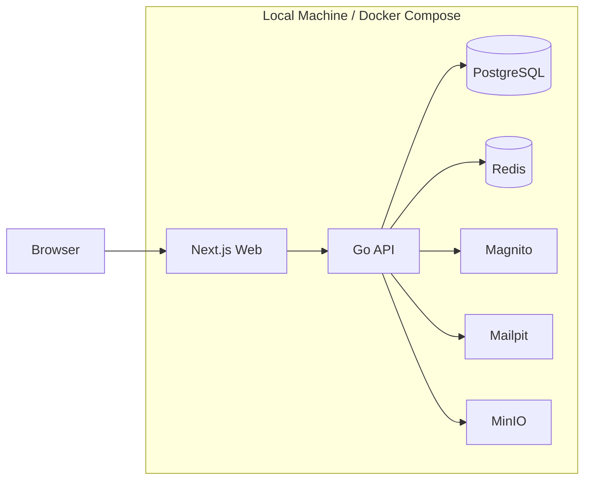
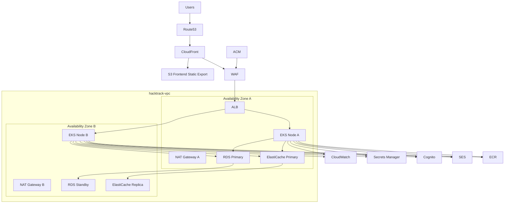

# インフラ構成

---

## 0️⃣ 設計前提

| 項目 | 内容 |
| --- | --- |
| 環境区分 | `dev` と `prod` の 2 環境を前提にする |
| `dev` | Docker Compose で動かすローカル実行環境 |
| `prod` | AWS 上のデプロイ環境。frontend は静的エクスポート成果物を配信する |
| アプリ側の主スイッチ | `.env` の `APP_ENV=dev | prod` |
| IaC | AWS リソースは Terraform で管理する |
| K8s方針 | `prod` の API は Kubernetes Pod として動かし、HPA で自動スケールする |
| 優先事項 | マルチテナント境界、再現性、説明しやすさ、将来のデプロイ容易性 |

補足:

- `APP_ENV` はアプリケーションから見た依存先の切替に使う。
- 実際の環境を作る処理は、`dev` では Docker Compose、`prod` では Terraform + Kubernetes manifest が担う。
- つまり `.env` だけでインフラが生成されるわけではないが、アプリケーションの接続先切替は `APP_ENV` を軸に一貫させる。

---

## 1️⃣ 全体方針

このプロダクトは、日常開発では `dev` のローカル環境を使い、デプロイ時には `prod` の AWS 構成へ写像する。

- `dev`: ローカル OSS を使って 1 台で再現する
- `prod`: AWS マネージドサービス + EKS で公開する
- アプリケーションは `APP_ENV=dev|prod` に応じて、認証、メール、ストレージ、キャッシュ、ログの接続先を切り替える
- `prod` の frontend は Next.js App Router を静的エクスポートして S3 + CloudFront で配信し、runtime SSR は使わない

---

## 2️⃣ `dev` ローカル実行環境



### `dev` で使う要素

| 要素 | 採用先 |
| --- | --- |
| Web | Next.js on Docker |
| API | Go API on Docker |
| DB | PostgreSQL |
| Cache | Redis |
| Auth | Magnito |
| Mail | Mailpit |
| Object Storage | MinIO |
| Log | stdout / Docker logs |

### `dev` の目的

- 日常開発
- E2E / 結合確認
- 招待、認証、スカウト送信のローカル再現

---

## 3️⃣ `prod` デプロイ環境



### `prod` で使う要素

| レイヤ | 採用先 |
| --- | --- |
| DNS | Route53 |
| CDN | CloudFront |
| Frontend Hosting | S3 Frontend Static Export |
| Edge Security | WAF |
| TLS | ACM |
| API Entry | ALB |
| Compute | EKS |
| Container Image | ECR |
| Database | RDS PostgreSQL Multi-AZ |
| Cache | ElastiCache for Redis |
| Auth | Cognito |
| Mail | SES |
| Secret | Secrets Manager |
| Monitoring / Logs | CloudWatch |

### `prod` の前提

- API は EKS 上で Pod として稼働する
- Pod は HPA でオートスケーリングする
- DB は Multi-AZ の Primary / Standby 構成
- `prod` の tenant スコープ主要テーブルでは PostgreSQL RLS を防御層として併用する
- Cache は Primary / Replica 構成
- Frontend は Next.js の静的エクスポート成果物を CloudFront + S3 で配信する
- CloudFront は静的配信用の S3 origin と API 用の ALB origin を持ち、`/api/*` などの動的通信は ALB 側へルーティングする

---

## 4️⃣ `APP_ENV=dev|prod` で切り替えるもの

### 4.1 主スイッチ

```text
APP_ENV=dev
APP_ENV=prod
```

### 4.2 `APP_ENV` から導出される接続先

| 領域 | `APP_ENV=dev` | `APP_ENV=prod` |
| --- | --- | --- |
| Auth | Magnito | Cognito |
| Mail | Mailpit | SES |
| Object Storage | MinIO | S3 |
| Cache | Redis | ElastiCache for Redis |
| DB | PostgreSQL on Docker | RDS PostgreSQL |
| Logs | stdout | CloudWatch Logs |

### 4.3 「.env を変えるだけで実現できるか」の整理

結論:

- アプリケーションの依存先切替という意味では `APP_ENV=dev|prod` で整理できる
- インフラの生成まで含めると `.env` だけでは実現できない

このドキュメントでは、以下の役割分担で固定する。

- `APP_ENV`: アプリケーションの接続先切替
- Docker Compose: `dev` 環境の実体化
- Terraform: `prod` の AWS リソース作成
- Kubernetes manifest: `prod` の Pod / HPA / Service 定義

---

## 5️⃣ `dev` と `prod` の対応表

| 項目 | `dev` | `prod` |
| --- | --- | --- |
| Frontend | Next.js dev server on Docker | Next.js static export + S3 + CloudFront |
| API | Go API on Docker | Go API on EKS |
| API公開 | localhost | CloudFront + WAF + ALB |
| DNS | localhost | Route53 |
| TLS | `http://localhost` を標準。HTTPS が必要な検証時のみ `mkcert` を使う | ACM |
| Auth | Magnito | Cognito |
| DB | PostgreSQL | RDS PostgreSQL Multi-AZ |
| Cache | Redis | ElastiCache for Redis |
| Mail | Mailpit | SES |
| Object Storage | MinIO | S3 |
| Secret | `.env` | Secrets Manager |
| Image Registry | 不要 | ECR |
| Logs | stdout / Docker logs | CloudWatch Logs |

---

## 6️⃣ Kubernetes 方針

### 6.1 採用理由

- API ワークロードを Pod 単位で管理したい
- スカウト送信や認証ピーク時に Pod 数を自動で増減したい
- 将来的なワーカー追加にも流用しやすい

### 6.2 `prod` で Kubernetes に置くもの

- API Deployment
- HPA
- Service
- Ingress / ALB 接続設定
- ConfigMap / Secret 参照設定

### 6.3 スケーリング方針

- Pod の自動スケーリングは HPA で行う
- ノードは EKS Managed Node Group を前提にする
- マルチ AZ に Pod を分散配置する

---

## 7️⃣ ネットワーク方針

### 7.1 `prod` のネットワーク構成

- VPC 配下に 2 AZ を持つ
- Public Subnet に ALB と NAT Gateway を置く
- Private Subnet に EKS Node を置く
- Database Subnet に RDS / ElastiCache を置く
- DB と Cache はインターネットへ直接公開しない

### 7.2 通信の流れ

```text
Users
  -> Route53
  -> CloudFront
  -> S3 Frontend or WAF
  -> ALB
  -> EKS Pod
  -> RDS / ElastiCache / Cognito / SES / S3 / CloudWatch / Secrets Manager
```

---

## 8️⃣ セキュリティ方針

### 8.1 エッジと入口

- Route53 でドメイン解決
- CloudFront を公開入口にする
- WAF を API 入口に適用する
- ACM で TLS を管理する

### 8.2 アプリケーション

- 認証は Cognito JWT を使う
- 認可はアプリケーション側で RBAC + ABAC を評価する
- Secrets は Secrets Manager から取得する

### 8.3 データ層

- RDS と ElastiCache は Private Subnet に置く
- テナント境界はアプリケーション認可を主とし、`prod` では PostgreSQL RLS を防御層として併用する
- 監査ログは CloudWatch に構造化 JSON で送る

---

## 9️⃣ 監視・ログ方針

### `dev`

- stdout を主に見る
- Mailpit UI でメール確認
- Docker logs で各サービスを追う

### `prod`

- CloudWatch Logs に集約する
- CloudWatch Container Insights を前提にする
- 構造化ログに `tenant_id`、`hackathon_id`、`actor_user_id` を含める

詳細は [docs/details/08_logging.md](/Users/kakiuchiakira/Code/indiDev/goApp/docs/details/08_logging.md) を参照する。

---

## 🔟 Terraform と Kubernetes の責務分離

### Terraform の責務

- Route53
- CloudFront
- WAF
- ACM
- VPC / Subnet / NAT Gateway
- EKS Cluster / Node Group
- RDS PostgreSQL
- ElastiCache for Redis
- Cognito
- SES
- S3
- ECR
- Secrets Manager
- CloudWatch の基盤側設定

### Kubernetes 側の責務

- API Deployment
- Pod 数の自動スケール
- ConfigMap / Secret の注入
- Service / Ingress 設定

---

## 1️⃣1️⃣ `infra/` ディレクトリでの表現

```text
infra/
├── docker/
│   └── compose.yml
├── terraform/
│   ├── modules/
│   └── environments/
│       ├── dev/
│       └── prod/
└── kubernetes/
    ├── base/
    ├── dev/
    └── prod/
```

方針:

- `docker/compose.yml` が `dev` の実体
- `terraform/environments/prod` が AWS リソースの実体
- `kubernetes/prod` が `prod` のワークロード定義

---

## 1️⃣2️⃣ 今回の前提で採用しないもの

- SQS
- OpenSearch
- Vector DB
- マルチリージョン
- 細かく分割されたマイクロサービス群

必要になったときに後から追加する。

---

## 1️⃣3️⃣ このドキュメントで固定すること

- `dev` は Docker Compose ベースのローカル環境
- `prod` は AWS + EKS ベースのデプロイ環境
- `APP_ENV=dev|prod` を主スイッチにする
- API は `prod` で Kubernetes Pod として動作し、HPA で自動スケールする
- `prod` の主要サービスは Route53、CloudFront、WAF、ALB、EKS、RDS、ElastiCache、Cognito、SES、S3、CloudWatch、Secrets Manager、ECR
